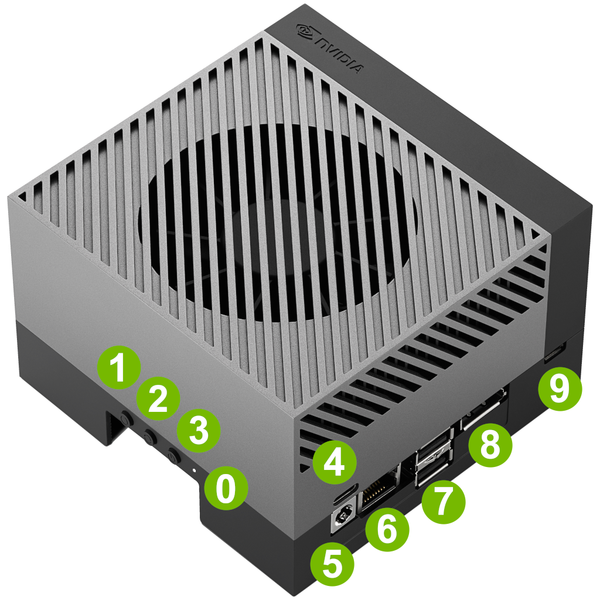
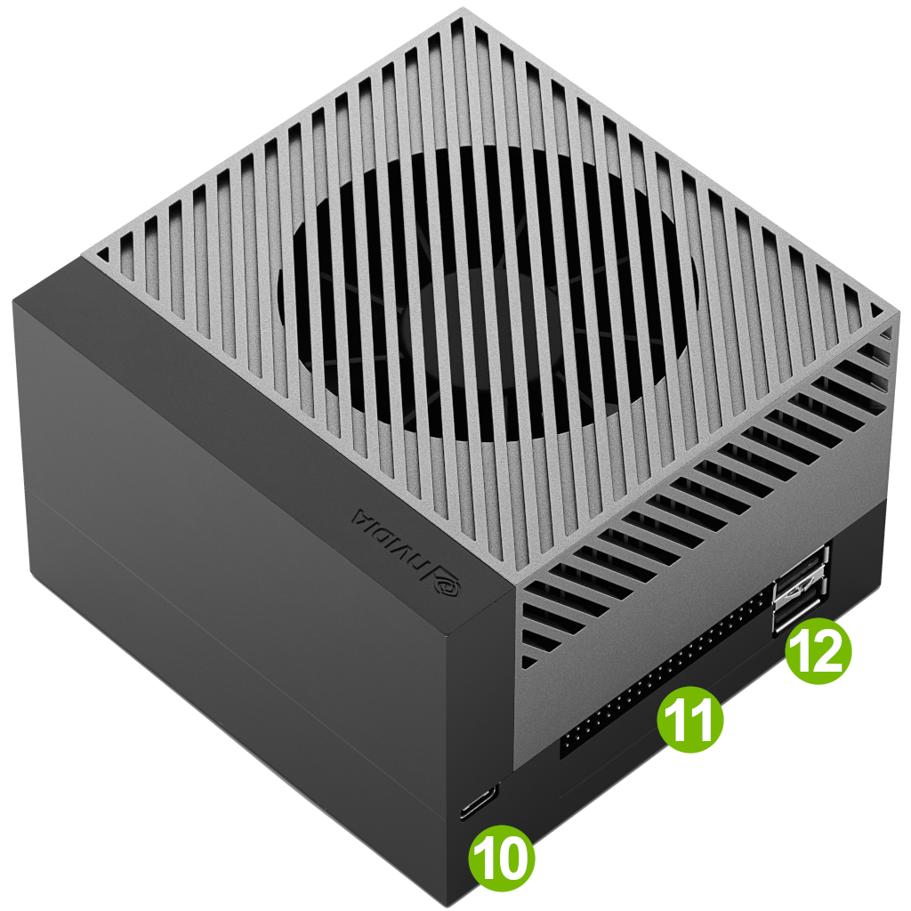

# Diseño de la Infraestructura y Selección de GPU para el TFG

Este documento describe las decisiones tomadas para la elección del hardware donde se ejecutará nuestro agente IA dentro del proyecto **Cl@udiata: Modelos de Lenguaje en la Analítica Deportiva**.  
Se detallan los criterios de selección de GPU, el análisis de las diferentes opciones disponibles y la justificación de la infraestructura elegida, considerando cómo optimizar el rendimiento del agente, la eficiencia energética y la gestión del ciclo de vida de los datos deportivos.

---

## INFRA-10: Investigar requisitos hardware

**Descripción:**  
Cómo estudiante, quiero conocer las especificaciones y requerimientos de las diferentes opciones de GPU para seleccionar el hardware adecuado para el TFG. 

**Objetivo:**  
Seleccionar el modelo de GPU que ofrezca un equilibrio óptimo entre capacidad de procesamiento e impacto ambiental asociado al entrenamiento y ejecución de modelos del **agente IA**

---

## 1. Requisitos

El diseño se ha fundamentado en los siguientes requerimientos clave para el TFG:

- Enfocada en clubes de fútbol semiprofesionales con recursos limitados.
- Desarrollo de un **agente IA generativo** capaz de responder preguntas sobre datos de partidos y estadísticas.
- Implementación de un **almacén de datos distribuido** siguiendo la **Arquitectura Medallón** con 3 años de datos históricos.
- **Manipulación y procesamiento de vídeo** (mejora de resolución, cortes automáticos de acciones) para análisis deportivo.
- Capacidad de **inferir y entrenar modelos IA** localmente, utilizando GPU compatible con TensorFlow, PyTorch, CUDA o TensorRT.
- Garantizar **eficiencia energética y bajo consumo** para operar en entornos con recursos limitados.
- **Sostenibilidad y Green IA**, minimizando el impacto ambiental asociado al entrenamiento y ejecución de modelos.
- Escalabilidad para **futuros proyectos**, incluyendo integración de cámaras, almacenamiento externo y modelos predictivos.
- **Escalabilidad con otros dispositivos**, de modo **cluster distribuido**.
- Soporte para **procesamiento local de datos sensibles**, asegurando privacidad y seguridad.


## 2. Comparativa de GPUs

A partir de los requerimientos expuestos y para asegurar la viabilidad del proyecto, se deduce que tendremos que contar con hardware adecuado para inferir – y en algunos casos entrenar - modelos IA.

Existen diversas opciones dentro del mercado para solventar el problema. En este articulo nos centraremos en las GPUs de NVIDIA, debido principalmente a la que son las más utilizadas por su compatibilidad con bibliotecas como TensorFlow, PyTorch, CUDA y TensorRT.


### Gama Tesla
- Tarjetas profesionales (T4, V100) diseñadas para centros de investigación y computación en la nube.
- Alto rendimiento pero requieren mucho espacio, buena ventilación y alto coste.
- No viables por limitaciones de recursos.

### Gama RTX
- Series RTX 30 y 40 con buena relación precio/rendimiento.
- Popularizadas para IA y minería de criptomonedas.
- Requieren hardware adicional (CPU, RAM), buena refrigeración y alto gasto energético.
- No viables por sostenibilidad y coste en el contexto del TFG.

### Familia NVIDIA Jetson
- Solución optimizada para Edge computing, integrando GPU, CPU y memoria en un solo dispositivo.
- Modelos: Jetson Nano, Xavier, Jetson AGX Orin.
- Ventajas: compacta, eficiente energéticamente, potente para inferencia local.
- Comunidad activa y documentación extensa.
- Elección ideal para el proyecto.

---

## 3. Tabla resúmen

| Dispositivo                 | TFLOPs FP16/FP32 | VRAM       | Costo (€) | Consumo (W) | Compatibilidad LLM | Idoneidad entorno local |
|-----------------------------|-----------------|------------|-----------|-------------|------------------|------------------------|
| NVIDIA Tesla V100           | 125 / 15.7      | 16 GB      | 8.000     | 300         | Alta             | Alto coste para clubes |
| NVIDIA RTX 4090             | 330 / 82.6      | 24 GB      | 1.900     | 450         | Alta             | Consumo y espacio alto |
| Jetson AGX Orin Dev Kit     | 275 (INT8)/65   | 32 GB LPDDR5 | 2.000     | 50 (config) | Alta (LLaMA 2)  | Ideal: eficiente e integrado |

---

## DAFO - NVIDIA Jetson AGX Orin Developer Kit

### Fortalezas
- Alto rendimiento para inferencia de modelos IA.
- VRAM de 32 GB LPDDR5, suficiente para tareas complejas como mejora de resolución y análisis de vídeo.
- Bajo consumo energético, ideal para uso continuo en entornos con recursos limitados.
- Compatibilidad con bibliotecas de IA como PyTorch, CUDA y TensorRT.
- Posibilidad de integrar cámaras externas para futuros proyectos IA y almacenamiento externo.
- Incluye conectividad: antena Wi-Fi y puerto Ethernet.
- Excelente relación rendimiento/precio por TFLOP y por vatio comparado con GPUs como RTX o Tesla.
- Escalabilidad y reutilización del hardware para nuevos proyectos o funcionalidades (predicción táctica).
- Alineación con aspectos de sostenibilidad y privacidad, con bajo impacto ambiental.

### Oportunidades
- Integración con nuevos proyectos de IA y expansión del sistema de almacenamiento.
- Uso como plataforma de prueba para prototipos y despliegues embebidos.
- Desarrollo de soluciones locales que no dependan de la nube.
- Potencial para entrenar modelos optimizados para inferencia en INT8.

### Debilidades
- Arquitectura aarch64 que puede dificultar el despliegue de software tradicional o precompilado.
- Requiere actualización de librerías para usar versiones recientes.
- Almacenamiento interno limitado, aunque ampliable.
- Es un kit de desarrollo con componentes limitados (sin pantalla, teclado, etc.).
- El uso de INT8 puede afectar la precisión de algunos modelos si no están bien calibrados.
- Dependencia del ecosistema NVIDIA para entornos embebidos.

### Amenazas
- Rápida evolución del hardware IA puede volver obsoleta esta opción en el medio/corto plazo.
- Limitaciones por ser hardware embebido en comparación con estaciones de trabajo más grandes.

---

## Caracteristicas

| Partes del Jetson AGX Orin | Imagenes |
|----------------------------|----------|
| Lista de conectores y botones |   |


| Nº  | Nombre                  | Nota                                                           |
|-----|------------------------|----------------------------------------------------------------|
| 0   | LED blanco             |                                                                |
| 1   | Botón de encendido     |                                                                |
| 2   | Botón Force Recovery   |                                                                |
| 3   | Botón de reinicio      |                                                                |
| 4   | Puerto USB Type-C      | Solo DFP                                                       |
| 5   | Conector de alimentación DC |                                                           |
| 6   | Puerto Ethernet        |                                                                |
| 7   | Puertos USB Type-A     | 2x USB 3.2 Gen 2                                              |
| 8   | Salida DisplayPort     | Única interfaz de pantalla en el Jetson AGX Orin Developer Kit |
| 9   | Puerto USB micro-B     | Para depuración                                               |
| 10  | Puerto USB Type-C      | También para flasheo (UFP y DFP)                              |
| 11  | Conector de 40 pines   |                                                                |
| 12  | Puertos USB Type-A     | 2x USB 3.2 Gen 1                                              |


## 4. Planificación de almacenamiento histórico

Para que el agente pueda ofrecer respuestas precisas, hemos planificado almacenar **3 años de datos históricos**, como no las caracteristicas presentadas no se adecuan será neceario añadir un disco NVMe externo dedicado. Para calcualar el tamaño adecuado se ha tenid en cuanta el potencial volumen de la liga.

## 4. Planificación de almacenamiento histórico

Para que el agente IA pueda ofrecer **respuestas precisas y contextualizadas**, se ha planificado almacenar **3 años de datos históricos** de la competición.  
Dado que el almacenamiento interno del dispositivo no es suficiente, se requiere un **disco NVMe externo dedicado**. La estimación del tamaño necesario se ha realizado considerando el volumen potencial de la liga.

### 4.1 Caso de uso

- Cada jornada contiene **8 partidos**.
- Por cada partido, los datos crudos generados son:
  - **1 PDF** (acta de partido): 266 KB
  - **1 video**: 2,5 GB (resolución optimizada para almacenamiento)
  - **1 HTML**: 125 KB
- Cada temporada tiene **38 jornadas**.
- Tras procesar los datos mediante los pipelines:
  - **1 JSON** (acta de partido): 18 KB
  - **x video para el entrenamiento**: 500 MB Total
  - **1 video resumen con x clips** procesado: 500 MB
  - **10 CSVs**: 200 KB

### 4.2 Estimación de espacio por carpeta

| Carpeta | Contenido | Tamaño por jornada | Tamaño por temporada (38 jornadas) | Tamaño para 3 temporadas |
|---------|-----------|-----------------|-------------------------------|-------------------------|
| Bronze  | Datos crudos (PDF, video 720p, HTML) | 20,13 GB | 764,94 GB ≈ 0,76 TB | 2,29 TB |
| Silver  | Datos procesados (JSON, video entrenamiento, video resumen, CSVs) | 1,03 GB | 39,14 GB ≈ 0,04 TB | 117,42 GB ≈ 0,12 TB |
| Gold    | Datos enriquecidos y reportes | 50 MB | 1,9 GB | 5,7 GB |


### 4.3 Disco NVMe externo para almacenamiento histórico

Para soportar los **3 años de datos históricos**, se ha adquirido un disco **NVMe externo de 4 TB** con disipador. La elecion de este disco  **WD Black** es basada por los siguentes motivos:

- Capacidad suficiente para almacenar los datos calculados anterirmente.
- Disipación de calor para un funcionamiento continuo sin riesgo de sobrecalentamiento.
- Conectividad rápida con el dispositivo NVIDIA Jetson AGX Orin para la transferencia de grandes volúmenes de datos (videos y JSONs).
- Preparación para crecimiento enexperado o datos no calculados en el presente.


### 4.3 Disco NVMe externo para almacenamiento histórico

Para garantizar que nuestro **agente IA ** pueda analizar y ofrecer respuestas precisas sobre la competición, se ha adquirido un **disco NVMe externo de 4 TB con disipador**, modelo **WD Black SN850 NVME SSD for PS5**, que servirá como almacenamiento principal para los **3 años de datos históricos**.  

La elección de este disco se justifica por los siguientes motivos:

- Capacidad suficiente para almacenar los datos calculados anterirmente
- Incorpora un disipador para evitar sobrecalentamiento durante la transferencia y procesamiento de grandes volúmenes de datos
- Compatible con el dispositivoNVIDIA Jetson AGX Orin
- Capacidad de 4TB para el almacenamiento de datos adicionales no contemplados inicialmente.

---

## Conclusión

La **NVIDIA Jetson AGX Orin Developer Kit** con disco duro **WD Black SN850 NVME SSD for PS5** se presenta como la opción óptima para desplegar el **agente IA** en nuestro entorno local para clubes semiprofesionales de fútbol, garantizando:

- Escalabilidad y rendimiento
- Eficiencia energética
- Integración embebida y soporte para tareas de inferencia y entrenamiento local
- Seguridad y privacidad

---

## Referencias

[Jetson AGX Orin Devkit User Guide] (https://developer.nvidia.com/embedded/learn/jetson-agx-orin-devkit-user-guide/developer_kit_layout.html)

[Jetson AGX Orin Developer Kit Carrier Board Specification] (https://developer.nvidia.com/assets/embedded/secure/jetson/agx_orin/jetson_agx_orin_devkit_carrier_board_specification_sp)

[Especificaciones Técnicas de WD Black SN850 NVME SSD] (https://documents.westerndigital.com/content/dam/doc-library/en_us/assets/public/western-digital/product/internal-drives/wd-black-ssd/data-sheet-wd-black-sn850-nvme-ssd-for-ps5.pdf)

[Deploying LLaMA 2 Models on Edge Devices: NVIDIA Jetson AGX Orin Case Study] (https://www.researchgate.net/publication/380155833_An_Empirical_Analysis_and_Resource_Footprint_Study_of_Deploying_Large_Language_Models_on_Edge_Devices). 

[Energy-Efficient AI Inference on Embedded Devices] (https://www.researchgate.net/publication/385300510_Power_Consumption_Benchmark_for_Embedded_AI_Inference)

[Especificaciones Técnicas de Jetson Orin] (https://www.nvidia.com/es-la/autonomous-machines/embedded-systems/jetson-orin/)

[Especificaciones Técnicas de Tesla V100] (https://www.nvidia.com/es-la/data-center/tesla-v100/)

[GeForce RTX Serie 40] (https://www.nvidia.com/es-la/geforce/graphics-cards/40-series/)

[Documentacion de Tensorflow] asd (https://www.tensorflow.org/?hl=es-419)

[Documentacion de PyTorch] (https://pytorch.org/docs/stable/index.html)

[Documentacion de CUDA Toolkit] (https://docs.nvidia.com/cuda/)

[Documentacion de TensorRT] (https://docs.nvidia.com/deeplearning/tensorrt/latest/index.html)

[Reglamento de Inteligencia Artificial de la UE]. (2023). *European Union AI Act*. (https://www.consilium.europa.eu/es/policies/artificial-intelligence/)


# Decisión de Hardware y Software para el Agente de Inteligencia Artificial

## 1. Hardware Seleccionado

**Dispositivo:** NVIDIA Jetson AGX Orin 64 GB  
**Motivo de selección:**

- GPU basada en **arquitectura Ampere** (2048 CUDA cores) compatible con TensorRT-LLM.
- Memoria LPDDR5 de **64 GB**, suficiente para modelos de lenguaje medianos (ej. LLaMA 2 7B INT8) y operaciones de inferencia.
- Soporta **Linux aarch64**, requerido por TensorRT-LLM y frameworks optimizados de NVIDIA.
- Conectividad y compatibilidad con JetPack 6.x para instalar SDK Manager y paquetes NVIDIA optimizados.

**Resumen:**

| Característica | Detalle |
|----------------|---------|
| GPU | NVIDIA Ampere, 2048 CUDA cores |
| RAM | 64 GB LPDDR5 |
| Arquitectura | aarch64 |
| Soporte JetPack | 6.2.1 (host Ubuntu 22.04) |

---

## 2. Software Seleccionado

**Sistema operativo host y target:**

- Ubuntu 22.04 LTS (host y Jetson target con JetPack 6.2.1)

**Paquetes principales:**

| Software | Versión | Motivo |
|----------|---------|--------|
| JetPack | 6.2.1 rev 1 | Compatible con AGX Orin, CUDA 12, cuDNN y TensorRT 10 |
| TensorRT-LLM | 0.12.0-jetson branch | Optimizado para JetPack 6.1+, GPU Ampere, soporte LLMs |
| TensorFlow | 2.16 (wheel optimizado v61) | Compatible con JetPack 6.1, necesario para componentes ML del agente |
| Python | 3.10 | Compatibilidad con TensorRT-LLM y wheels NVIDIA |

**Notas de instalación:**

- Se usarán los wheels precompilados de NVIDIA en la carpeta `v61/` de [NVIDIA Redist JP](https://developer.download.nvidia.com/compute/redist/jp/v61/).
- SDK Manager se utilizará para flashear y gestionar dependencias en el Jetson AGX Orin.

---

## 3. Arquitectura del Agente

**Diagrama conceptual:**

[Usuario / API] --> [Agente en Jetson AGX Orin]
|
v
[TensorRT-LLM / TensorFlow]
|
v
[Modelo LLM optimizado]

markdown
Copiar código

**Componentes principales:**

1. **Agente**: código Python que recibe entradas de usuario y gestiona la inferencia del LLM.
2. **TensorRT-LLM**: motor de inferencia optimizado para GPU Ampere, maneja la ejecución de modelos LLM en tiempo real.
3. **TensorFlow**: utilizado para componentes ML adicionales y compatibilidad con librerías de NVIDIA.
4. **Modelo LLM**: modelo de lenguaje entrenado, por ejemplo LLaMA 2 7B en INT8/INT4 para eficiencia en el Jetson.

**Flujo de operación:**

1. Usuario envía una consulta.
2. Agente recibe la entrada y la preprocesa.
3. TensorRT-LLM ejecuta la inferencia sobre el modelo LLM optimizado.
4. Resultado se postprocesa y se devuelve al usuario.

---

## 4. Referencias

1. [TensorRT-LLM GitHub Repository](https://github.com/NVIDIA/TensorRT-LLM)  
2. [NVIDIA Jetson AGX Orin Specifications](https://developer.nvidia.com/embedded/jetson-agx-orin)  
3. [NVIDIA JetPack Download & SDK Manager](https://developer.nvidia.com/embedded/jetpack)  
4. [NVIDIA Redist JP v61](https://developer.download.nvidia.com/compute/redist/jp/v61/)  
5. [TensorRT Documentation](https://docs.nvidia.com/deeplearning/tensorrt/)  

---

**Decisión final:**  
Se utilizará **Jetson AGX Orin 64 GB** con **JetPack 6.2.1**, instalando **TensorRT-LLM** y **TensorFlow optim


# Decisión de Hardware y Software para el Agente de Inteligencia Artificial

## 1. Hardware Seleccionado

**Dispositivo:** NVIDIA Jetson AGX Orin 64 GB  

**Motivo de selección:**

- GPU basada en **arquitectura Ampere** (2048 CUDA cores) compatible con TensorRT-LLM.
- Memoria LPDDR5 de **64 GB**, suficiente para modelos de lenguaje medianos.
- Soporta **Linux aarch64**, requerido por TensorRT-LLM y frameworks optimizados de NVIDIA.
- Conectividad y compatibilidad con JetPack 6.x para instalar SDK Manager y paquetes NVIDIA optimizados.

**Resumen:**

| Característica | Detalle |
|----------------|---------|
| GPU | NVIDIA Ampere, 2048 CUDA cores |
| RAM | 64 GB LPDDR5 |
| Arquitectura | aarch64 |
| Soporte JetPack | 6.2.1 (host Ubuntu 22.04) |

---

## 2. Software Seleccionado

**Sistema operativo host y target:**

- Ubuntu 22.04 LTS (host y Jetson target con JetPack 6.2.1)

**Paquetes principales:**

| Software | Versión | Motivo |
|----------|---------|--------|
| JetPack | 6.2.1 rev 1 | Compatible con AGX Orin, CUDA 12, cuDNN y TensorRT 10 |
| TensorRT-LLM | 0.12.0-jetson branch | Optimizado para JetPack 6.1+, GPU Ampere, soporte LLMs |
| TensorFlow | 2.16 (wheel optimizado v61) | Compatible con JetPack 6.1, necesario para componentes ML del agente |
| Python | 3.10 | Compatibilidad con TensorRT-LLM y wheels NVIDIA |

---

## 3. Arquitectura del Agente

**Diagrama Mermaid:**

```mermaid
flowchart LR
    A[Usuario / API] --> B[Agente en Jetson AGX Orin]
    B --> C[TensorRT-LLM / TensorFlow]
    C --> D[Modelo LLM optimizado]
    D --> C
    C --> B
    B --> A
Descripción del flujo:

El usuario envía una consulta al agente.

El agente recibe la entrada y la preprocesa.

TensorRT-LLM ejecuta la inferencia del modelo LLM optimizado en la GPU Ampere.

Los resultados se postprocesan y se devuelven al usuario.

4. Referencias
TensorRT-LLM GitHub Repository

NVIDIA Jetson AGX Orin Specifications

NVIDIA JetPack Download & SDK Manager

NVIDIA Redist JP v61

TensorRT Documentation

yaml
Copiar código

---

Este **diagrama Mermaid** representa de forma clara la interacción entre usuario, agente, TensorRT-LLM/TensorFlow y el modelo LLM optimizado.  

Si quieres, puedo añadir **una versión extendida con módulos adicionales**, como almacenamiento de caché de claves, manejo de sesiones y logging del agente, para que el diagrama refleje toda la arquitectura real de producción.  

¿Quieres que haga esa versión extendida?