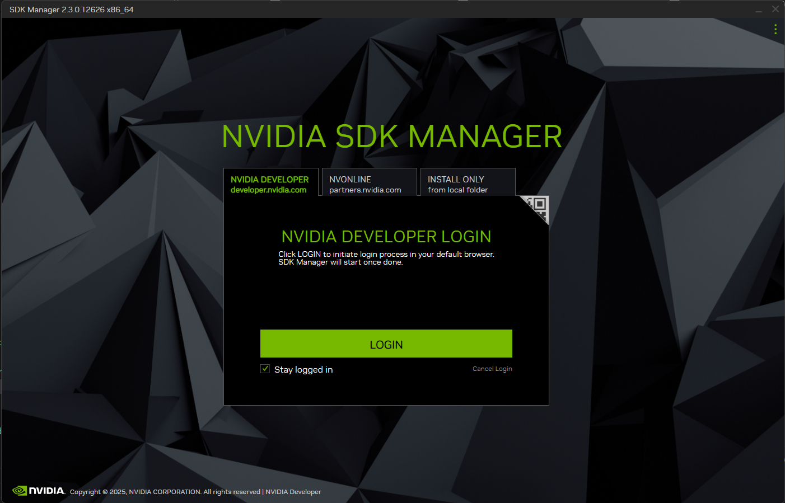
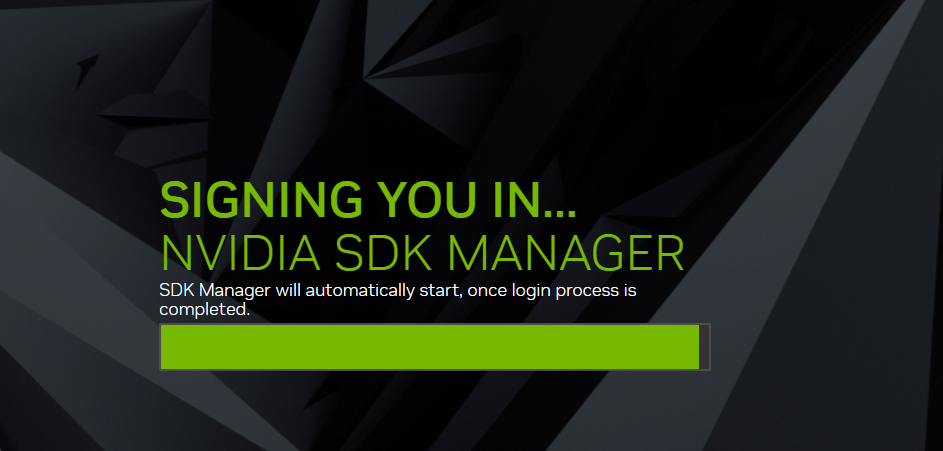
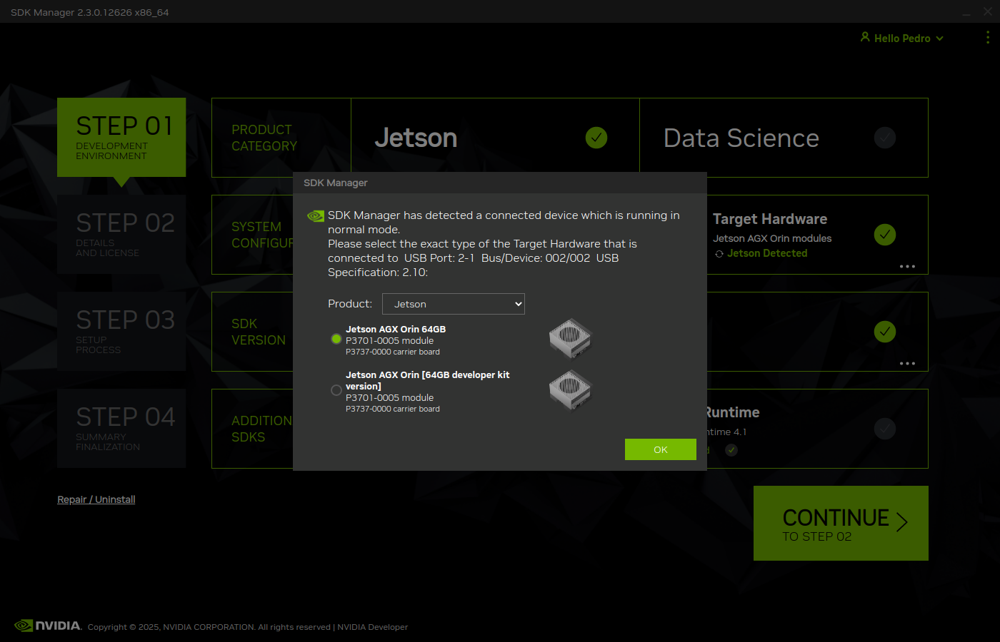
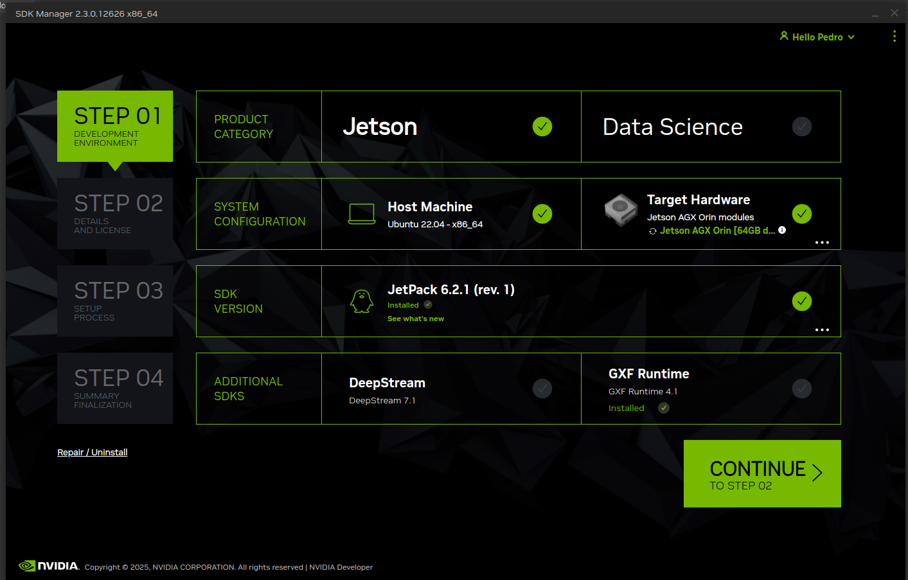
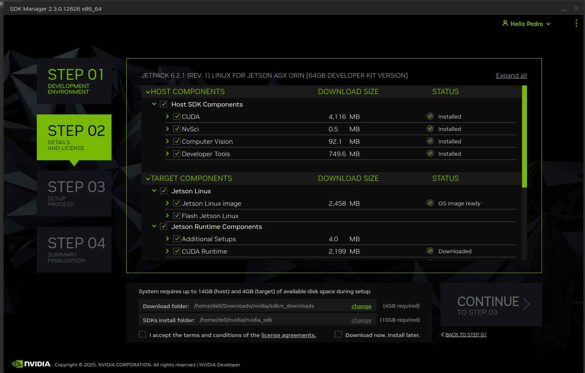
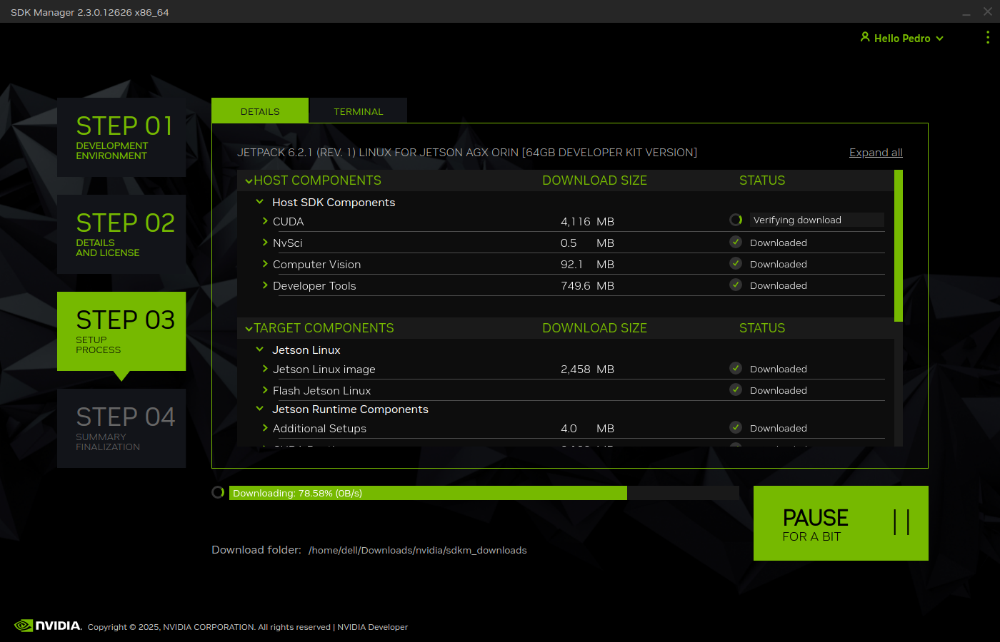

# Flashing and CUDA installation using SDK Manager Installation

Este documento describe las decisiones tomadas para la elección del hardware donde se ejecutará nuestro agente IA dentro del proyecto **Cl@udiata: Modelos de Lenguaje en la Analítica Deportiva**.  
Se detallan los criterios de selección de GPU, el análisis de las diferentes opciones disponibles y la justificación de la infraestructura elegida, considerando cómo optimizar el rendimiento del agente, la eficiencia energética y la gestión del ciclo de vida de los datos deportivos.

---

## INFRA-20: Configurar entorno de trabajo

## Descripción
Como estudiante, quiero instalar y configurar un entorno Linux compatible (**JetPack, CUDA, TensorRT**) que permita desarrollar y desplegar proyectos de ciencia de datos modernos, garantizando la ejecución eficiente del agente generativo **Cl@udiata** en el **NVIDIA Jetson AGX Orin Developer Kit**.

## Objetivo
Asegurar que el entorno esté correctamente configurado para soportar todas las herramientas necesarias del proyecto, incluyendo bibliotecas de IA, frameworks de visión por computadora y módulos de análisis de datos.

---

## 1. Preparación del entorno

El entorno base del **Jetson AGX Orin** se configura mediante el sistema **JetPack SDK**, el cual incluye las siguientes herramientas esenciales:

| Componente | Descripción | Versión recomendada |
|-------------|--------------|---------------------|
| **Ubuntu for Jetson** | Sistema operativo Linux optimizado para ARM64 | 22.04 LTS |
| **CUDA Toolkit** | Plataforma para computación paralela en GPU | 12.2 |
| **cuDNN** | Librerías de redes neuronales optimizadas para CUDA | 9.0 |
| **TensorRT** | Framework para optimización e inferencia de modelos IA | 10.0 |
| **DeepStream SDK** | Análisis de vídeo y flujos multimedia en tiempo real | 7.0 |
| **Jetson SDK Components** | Drivers, API y herramientas de desarrollo para Edge AI | Incluido en JetPack 6.0 |

Estas herramientas aseguran la compatibilidad total con bibliotecas de IA como **PyTorch**, **TensorFlow**, **OpenCV** y **Transformers** (Hugging Face).

---
## 2. Modo Recovery y Preparación para Flasheo


### 2.1 Requisitos previos

- Ordenador host con **Ubuntu 22.04 (x86_64)**  
- Cable **USB-C a USB-A o USB-C**  
- Conexión a Internet estable  
- Espacio libre: mínimo **30 GB**  
- Fuente de alimentación conectada al Jetson  

### 2.2 Descarga de SDK Manager

En el host Ubuntu:

```bash
sudo apt-get update
sudo apt-get -y  install sdkmanager
```

### 2.3 Jetson en modo Recovery

Antes de instalar el sistema operativo en la NVIDIA Jetson AGX Orin, es necesario poner el dispositivo en modo recuperación (Recovery Mode). 

Este proceso permite que un ordenador host con Ubuntu reconozca la Jetson como un dispositivo listo para ser flasheado mediante SDK Manager.

Para poner la Jetson AGX Orin en modo Recovery, sigue estos pasos:

1. [Leer Guia] (https://developer.nvidia.com/embedded/learn/jetson-agx-orin-devkit-user-guide/two_ways_to_set_up_software.html) y ver video Jetpack 6.2: Command Line Install for Orin Nano and AGX (https://www.youtube.com/watch?v=WQg3PEUBiD8)
2. Apaga el dispositivo.
3. Conecta el cable USB tipo-C al puerto marcado como Recovery / Flash (generalmente el puerto USB-C posterior).
4. Mantén presionado el botón "Force Recovery".
5. Mientras lo mantienes pulsado, presiona el botón "Power" durante 2 segundos.
6. Suelta ambos botones.

### 2.3 Flasheo del sistema operativo

Iniciar el SDK Manager:

```bash 
sdkmanager 
```

Sigue las intrucuiones dentro del host externo en el SDK Manager:

| Flasheo del sistema operativo | Imagenes |
|----------------------------|----------|
| Iniciar sesión con una cuenta de desarrollador de NVIDIA. |   |
| STEP 1: Product: Jetson (Jetson AGX Orin [64GB developer kit version]) | |
|  STEP 1: SDK Version: JetPack 6.2.1 (rev. 1) (Pulse Continuar) || |
| STEP 2: Selecciona todos las opcines: CUDA, NvSci, Computer Vision, Developer Tools (Acepta terminos y Pulse Continuar) | |
| STEP 3: IP: Automatico, Usuario: claudia, Sotage Device NVMe (Pulse Flah) | | |
| STEP 4:  Una vez completado, la Jetson se reiniciará automáticamente con el sistema JetPack instalado (Pulse Finish) | | |

### 3 Configuración inicial **Jetson AGX Orin**

Conectar teclado, ratón y pantalla para completar el asistente de configuración inicial (idioma, red, contraseña).

Abre un terminal y verifica la instalación:
```bash
nvcc --version
python3 --version
nvidia-smi
df -h
```

Deverias ver also así:
```yaml
nvcc: NVIDIA (R) Cuda compiler driver
Copyright (c) 2005-2024 NVIDIA Corporation
Built on Wed_Aug_14_10:14:07_PDT_2024
Cuda compilation tools, release 12.6, V12.6.68
Build cuda_12.6.r12.6/compiler.34714021_0

Python 3.10.12

Mon Oct 13 21:50:02 2025
+---------------------------------------------------------------------------------------+
| NVIDIA-SMI 540.4.0                Driver Version: 540.4.0      CUDA Version: 12.6     |
|-----------------------------------------+----------------------+----------------------+
| GPU  Name                 Persistence-M | Bus-Id        Disp.A | Volatile Uncorr. ECC |
| Fan  Temp   Perf          Pwr:Usage/Cap |         Memory-Usage | GPU-Util  Compute M. |
|                                         |                      |               MIG M. |
|=========================================+======================+======================|
|   0  Orin (nvgpu)                  N/A  | N/A              N/A |                  N/A |
| N/A   N/A  N/A               N/A /  N/A | Not Supported        |     N/A          N/A |
|                                         |                      |                  N/A |
+-----------------------------------------+----------------------+----------------------+

+---------------------------------------------------------------------------------------+
| Processes:                                                                            |
|  GPU   GI   CI        PID   Type   Process name                            GPU Memory |
|        ID   ID                                                             Usage      |
|=======================================================================================|
|  No running processes found                                                           |
+---------------------------------------------------------------------------------------+

Filesystem       Size  Used Avail Use% Mounted on
/dev/nvme0n1p1   3,6T   24G  3,4T   1% /
tmpfs             31G  136K   31G   1% /dev/shm
tmpfs             13G   35M   13G   1% /run
tmpfs            5,0M  4,0K  5,0M   1% /run/lock
/dev/nvme0n1p10   63M  110K   63M   1% /boot/efi
tmpfs            6,2G   96K  6,2G   1% /run/user/128
tmpfs            6,2G   80K  6,2G   1% /run/user/1000
```