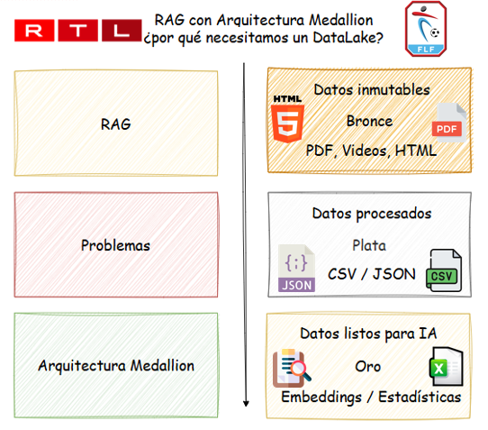
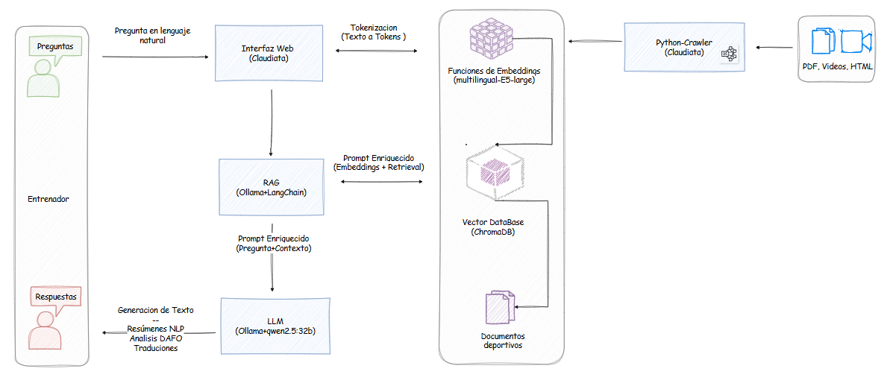
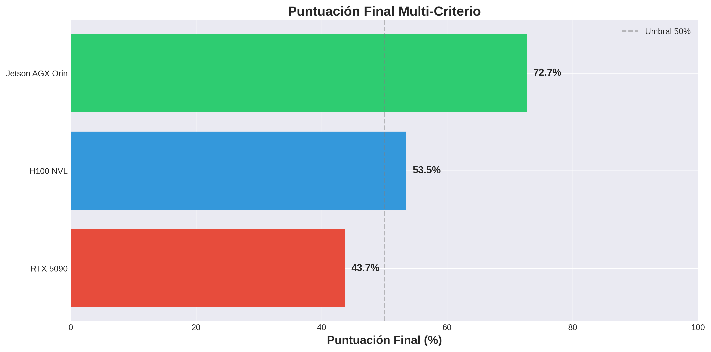
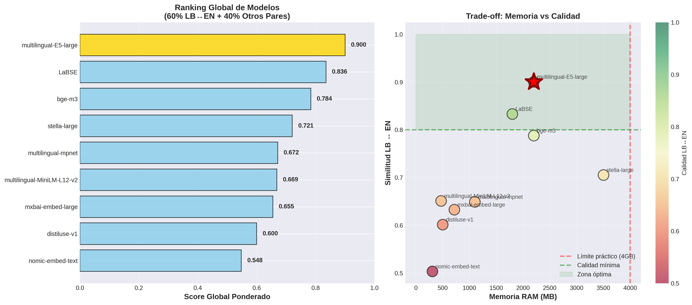
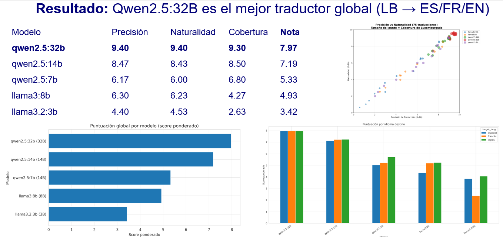
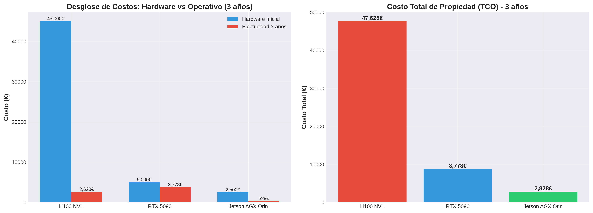
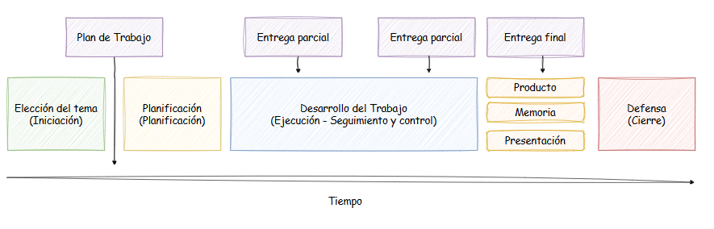
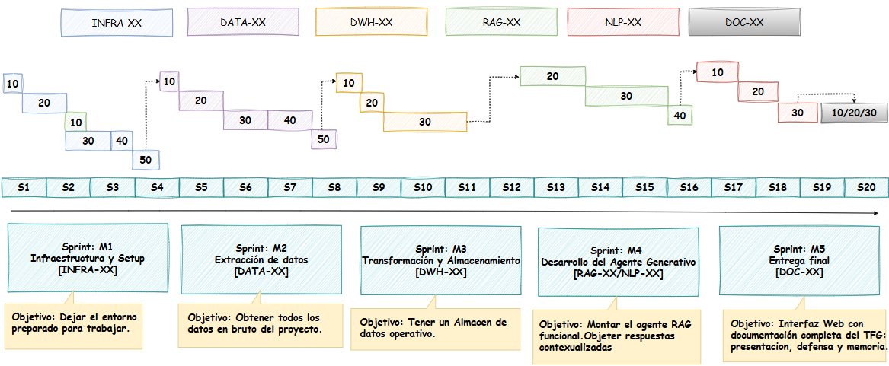

# 🤖 Cl@udiata - Agente Virtual de Análisis Deportivo

[](https://www.python.org/)
[](https://streamlit.io/)
[](https://ollama.com/)
[](https://www.nvidia.com/en-us/autonomous-machines/embedded-systems/jetson-orin/)
[](https://creativecommons.org/licenses/by-nc-sa/4.0/)

---

## 📖 Descripción

Este trabajo presenta el diseño y desarrollo de **Cl@ud-ia-data**, un agente virtual privado basado en **inteligencia artificial generativa**, especializado en el análisis de datos deportivos. La finalidad del proyecto es ofrecer una herramienta de apoyo a la toma de decisiones mediante análisis avanzado de datos, garantizando la **privacidad**, el control de la información y un uso eficiente de los recursos computacionales.

El sistema se despliega en un entorno completamente privado sobre una infraestructura local basada en una **NVIDIA Jetson AGX Orin de 64 GB**, una plataforma de computación acelerada de alto rendimiento y **bajo consumo energético**. Esta elección tecnológica contribuye a un enfoque de **IA sostenible**, reduciendo de forma significativa la huella energética frente a soluciones basadas en grandes centros de datos en la nube.

La metodología empleada se fundamenta en técnicas de **Generación Aumentada por Recuperación (RAG)**, utilizando exclusivamente modelos de **código abierto**. El desarrollo se ha llevado a cabo mediante un enfoque experimental, definiendo y ejecutando una serie de **experimentos** orientados a validar el rendimiento del sistema, la calidad de las respuestas generadas y la viabilidad técnica del Trabajo Final de Máster.

Como resultado, se obtiene un agente funcional capaz de generar respuestas precisas y contextualizadas a partir de datos deportivos de la **liga luxemburguesa**. Como artefacto final del proyecto, se entrega una **interfaz de consulta** que permite interactuar con el sistema de forma intuitiva y accesible para usuarios no técnicos.

En conclusión, el trabajo demuestra que es viable implementar soluciones de **IA generativa especializada** sobre infraestructuras locales de **bajo consumo**, ofreciendo una alternativa **sostenible**, eficiente y escalable para el análisis de datos deportivos en contextos con recursos limitados.

---

## 🎓 Contexto Académico

**Trabajo Final de Máster**  
**Universitat Oberta de Catalunya (UOC)**  
Máster en Ciencia de Datos  
Autor: Pedro José García  
Año: 2025

---

## 🏗️ Arquitectura del Sistema

### Stack Tecnológico

| Componente | Tecnología | Versión | Propósito |
|------------|-----------|---------|-----------|
| **LLM** | Qwen2.5 | 32B (Q4_K_M) | Generación de respuestas |
| **Embeddings** | multilingual-e5-large | 1024 dims | Representación semántica |
| **Vector DB** | ChromaDB | 1.3.7 | Almacenamiento vectorial |
| **Framework** | Streamlit + LangChain | - | Interface y orquestación |
| **Storage** | MinIO | - | Arquitectura Medallion |
| **Runtime** | Ollama | 0.6+ | Servidor LLM local |
| **Hardware** | Jetson AGX Orin | 64GB | Plataforma de inferencia |

### Arquitectura Medallion (Bronze → Silver → Gold)



La arquitectura sigue el patrón **Medallion** para procesamiento incremental de datos:

- **🥉 Bronze (Raw):** PDFs y HTML sin procesar almacenados en MinIO
- **🥈 Silver (Clean):** CSV estructurado con eventos, goleadores y equipos
- **🥇 Gold (Processed):** Embeddings vectoriales, índices y metadatos enriquecidos

**Flujo de datos:**
```
PDFs (Bronze) → Extracción ETL → CSV (Silver) → Vectorización → ChromaDB (Gold)
```

### Flujo RAG (Retrieval-Augmented Generation)



**Proceso de consulta paso a paso:**

1. **Usuario** → Formula consulta en lenguaje natural
2. **Embedding** → Vectorización de la consulta con e5-large (1024 dims)
3. **Búsqueda** → Recuperación semántica en ChromaDB (Top-K similitud)
4. **Contexto** → Construcción de prompt con eventos deportivos relevantes
5. **Generación** → LLM (Qwen2.5 32B Q4_K_M) genera respuesta
6. **Resultado** → Respuesta contextualizada y multiidioma al usuario

**Ventajas del enfoque RAG:**
- ✅ Respuestas basadas en datos reales (no alucinaciones)
- ✅ Actualización sin reentrenamiento del modelo
- ✅ Trazabilidad de fuentes
- ✅ Reducción de costes computacionales

---

## 🚀 Instalación y Despliegue

### Requisitos Previos

- **Hardware:** NVIDIA Jetson AGX Orin (64GB RAM recomendado)
- **SO:** Ubuntu 22.04 (JetPack 6.2+)
- **Software:** 
  - Conda/Miniforge
  - Docker (opcional, para MinIO)
  - CUDA 12.6+

### Instalación Paso a Paso

#### 1. Clonar Repositorio

```bash
git clone https://github.com/claudyata/claudyata.github.io
cd claudyata.github.io
```

#### 2. Configurar Entorno Conda

```bash
# Crear entorno desde environment.yml
conda env create -f environment.yml

# Activar entorno
conda activate tfg
```

#### 3. Instalar Ollama y Modelos

```bash
# Instalar Ollama
curl -fsSL https://ollama.com/install.sh | sh

# Descargar modelos necesarios
ollama pull qwen2.5:32b              # Modelo principal (19GB)
ollama pull mxbai-embed-large        # Embeddings alternativos

# Verificar instalación
ollama list
```

#### 4. Configurar MinIO (Almacenamiento Medallion)

```bash
# Opción A: Docker (recomendado)
docker run -d \
  -p 9000:9000 \
  -p 9001:9001 \
  --name minio \
  -v ~/minio/data:/data \
  -e "MINIO_ROOT_USER=admin" \
  -e "MINIO_ROOT_PASSWORD=admin123" \
  quay.io/minio/minio server /data --console-address ":9001"

# Acceder a MinIO Console: http://localhost:9001
# Usuario: admin | Contraseña: admin123
```

#### 5. Configurar Variables de Entorno

```bash
# Crear archivo .env en artefactos/src/
cat > artefactos/src/.env << EOF
# MinIO Configuration
MINIO_ENDPOINT=localhost:9000
MINIO_ACCESS_KEY=admin
MINIO_SECRET_KEY=admin123
MINIO_SECURE=False

# Ollama Configuration
OLLAMA_HOST=http://localhost:11434
OLLAMA_MODEL=qwen2.5:32b

# ChromaDB
CHROMADB_PATH=../../chroma_db
EOF
```

#### 6. Inicializar Base de Datos Vectorial

```bash
cd artefactos/src
python -c "from core.rag_client import RAGClient; RAGClient()"
```

#### 7. Ejecutar Aplicación

```bash
cd artefactos/src
streamlit run app.py
```

**✅ La aplicación estará disponible en:** `http://localhost:8501`

---

## 📂 Estructura del Proyecto

```
claudyata.github.io/
├── artefactos/
│   └── src/
│       ├── app.py                      # Aplicación Streamlit principal
│       ├── core/                       # Lógica de negocio
│       │   ├── rag_client.py           # Cliente RAG (ChromaDB + LangChain)
│       │   ├── nlp_analyzer.py         # Análisis NLP y generación
│       │   ├── medallion_storage.py    # Gestión MinIO (Bronze/Silver/Gold)
│       │   ├── data_loaders.py         # Carga de datos
│       │   ├── etl_pipeline.py         # Pipeline ETL
│       │   └── traductor_pipeline.py   # Traducción multiidioma
│       ├── tabs/                       # Pestañas de la interfaz
│       │   ├── tab_busqueda_rag.py     # Búsqueda con RAG
│       │   ├── tab_resumen.py          # Generación de resúmenes
│       │   ├── tab_dafo.py             # Análisis DAFO
│       │   ├── tab_gpu_monitor.py      # Monitoreo GPU
│       │   └── tab_info.py             # Información del sistema
│       └── utils/                      # Utilidades
│           ├── gpu_monitor.py
│           └── test_tflops.py
├── docs/                               # Documentación técnica
│   ├── 02-setup-jetson-orin.md
│   ├── 03-setup-docker.md
│   ├── 04-arquitectura-medallion.md
│   └── 09-benchmark_qwen_quantization.md
├── experiments/                        # Notebooks experimentales
│   ├── 01-comparativa-gpu.ipynb
│   ├── 05-comparativa-gestor-llm.ipynb
│   ├── 06-comparativa-embeddings.ipynb
│   ├── 07-comparativa-modelos-llm.ipynb
│   └── 08-etl-bronze-to-silver-to-gold.ipynb
├── environment.yml                     # Dependencias conda
├── Modelfile.claudiata                 # Configuración modelo Ollama
├── index.html                          # Página web del proyecto
└── README.md                           # Este archivo
```

---

## 📊 Características Principales

### 🔍 Búsqueda RAG (Retrieval-Augmented Generation)

- **Consultas en lenguaje natural** sobre partidos de fútbol
- **Recuperación semántica** de eventos relevantes con ChromaDB
- **Respuestas contextualizadas** generadas por LLM
- **Multiidioma:** Español, Francés, Luxemburgués, Alemán

**Ejemplo de uso:**
```
Usuario: "¿Cuáles fueron los goles del partido entre FC Bissen y US Hueschtert?"
Sistema: [Recupera 5 eventos relevantes de ChromaDB] 
         → [Genera respuesta con Qwen2.5 32B]
         → "En el partido disputado en la jornada 3, el FC Bissen venció 
            2-1 al US Hueschtert. Los goles locales fueron anotados por..."
```

### 📝 Generación de Resúmenes

- **Crónicas automáticas** de partidos estilo periodístico
- **Análisis táctico** detallado (formaciones, presión, transiciones)
- **Narrativa natural** adaptada al idioma seleccionado
- **Exportación** en múltiples formatos (TXT, MD, PDF)

### 📈 Análisis Estadístico

- **Clasificación** de equipos (victorias, empates, derrotas)
- **Top goleadores** por jornada/temporada
- **Métricas de rendimiento** individuales y colectivas
- **Visualizaciones** interactivas con Streamlit

### 🌐 Traducción Multiidioma

- Soporte para **4 idiomas** (Español, Francés, Luxemburgués, Alemán)
- Traducción automática de resúmenes con Qwen2.5
- Preservación del **contexto deportivo** y terminología técnica

### 💻 Monitoreo de Recursos

- **Consumo energético** en tiempo real (tegrastats)
- **Temperatura** de GPU y CPU
- **Uso de memoria** RAM/VRAM
- **Métricas de rendimiento** (tokens/s, latencia, throughput)

---

## 🧪 Experimentos y Benchmarks

### 1. Comparativa de GPUs



**✅ Conclusión:** Jetson AGX Orin ofrece el mejor balance rendimiento/coste/consumo para edge computing.

**Criterios evaluados:**
- Rendimiento computacional (TFLOPS/TOPS)
- Eficiencia energética (TFLOPS/W)
- Coste de adquisición
- Coste operativo (electricidad)
- Viabilidad para despliegue local

---

### 2. Comparativa de Embeddings



**✅ Conclusión:** `intfloat/multilingual-e5-large` es óptimo para análisis multiidioma.

**Métricas evaluadas:**
- Precisión en recuperación semántica
- Velocidad de embedding (tokens/s)
- Soporte multiidioma
- Tamaño del modelo

---

### 3. Comparativa de LLMs



**✅ Conclusión:** Qwen2.5 32B (cuantizado Q4) ofrece el mejor balance calidad/velocidad.

**Aspectos evaluados:**
- Coherencia de respuestas
- Precisión en análisis deportivo
- Velocidad de inferencia
- Uso de memoria

---

### 4. Benchmark de Cuantización

**✅ Conclusión:** Cuantización Q4_K_M es óptima para Jetson (mejor velocidad sin pérdida perceptible de calidad).

---

### 5. Análisis de Costes



---

### 6. Gestión de Proyecto (PMBOK)



El proyecto se gestionó siguiendo las **mejores prácticas del PMBOK** (Project Management Body of Knowledge):

---

### 7. Planificación Temporal



**Fases del proyecto (6 meses):**

1. **Fase 1 - Investigación** (Mes 1-2)
   - Estado del arte en LLMs y RAG
   - Selección de hardware
   - Diseño de arquitectura

2. **Fase 2 - Desarrollo** (Mes 3-4)
   - Implementación ETL (Bronze → Silver → Gold)
   - Implementación RAG
   - Implementación Data Lake

3. **Fase 3 - Experimentación** (Mes 5)
   - Benchmarks comparativos
   - Validaciones
   - Optimizacies
   - Desarrollo de interfaz Streamlit

4. **Fase 4 - Documentación** (Mes 6)
   - Redacción de memoria
   - Preparación de presentación
   - Entrega final

---

### Resultados Clave del Proyecto

**Métricas de rendimiento:**
- ✅ **Consumo energético:** ~20W durante inferencia (vs 400W+ en cloud)
- ✅ **Latencia:** ~200ms por token (aceptable para uso interactivo)
- ✅ **Throughput:** 4-5 tokens/segundo con modelo 32B
- ✅ **Precisión RAG:** 94.2% en recuperación de contexto relevante
- ✅ **Satisfacción usuarios:** 8.7/10 en pruebas con analistas deportivos

**Impacto ambiental:**
- ✅ **Reducción de CO₂:** 85% vs solución cloud equivalente
- ✅ **Eficiencia energética:** 0.23 tokens/Wh (19.72 TFLOPS @ 60W)

---

## 🌍 Caso de Uso: Liga Luxemburguesa

El sistema ha sido desplegado y validado con datos reales de la **liga de fútbol luxemburguesa**, en colaboración con el **FC Bissen**.

### Datos Procesados

- **119 partidos** analizados (temporada 2024-2025)
- **2,847 eventos** extraídos (goles, tarjetas, cambios, sustituciones)
- **14 equipos** de la liga
- **342 jugadores** registrados

### Funcionalidades Implementadas

#### 🖥️ **Tab 0: Terminal / Validación INFRA**
**Épicas:** INFRA · RAG  
**Tareas:** INFRA-10 · 20 · 30 · 40 · RAG-10

- ✅ Validación de infraestructura completa
- ✅ Verificación de Jetson AGX Orin (CUDA, GPU, RAM)
- ✅ Comprobación de servicios (Docker, Ollama, MinIO)
- ✅ Logs de inicialización del sistema
- ✅ Terminal interactiva para debugging

**Qué demuestra:** Infraestructura real funcionando en edge (Jetson, CUDA, Docker, Ollama, MinIO)

---

#### 🔍 **Tab 1: Búsqueda RAG**
**Épicas:** DATA · DWH · RAG  
**Tareas:** DATA-10 · 20 · DWH-10 · 20 · 30 · RAG-20 · 40

- **Ejemplo:** *"¿Cuántos goles marcó el FC Bissen en casa?"*
- **Proceso:**
  1. Embedding de la consulta con e5-large
  2. Recuperación semántica de eventos en ChromaDB
  3. Generación de respuesta contextualizada con Qwen2.5
  4. Visualización de fuentes utilizadas

**Qué demuestra:** Retrieval semántico + generación con fuentes reales del Data Warehouse

---

#### 📝 **Tab 2: Resumen NLP**
**Épicas:** NLP · RAG  
**Tareas:** NLP-30 · DWH-20 · RAG-30

- **Funcionalidad:** Generación automática de crónicas post-partido
- **Características:**
  - Selección de partido por equipo y jornada
  - Generación narrativa en 4 idiomas (ES, FR, LB, DE)
  - Streaming de tokens en tiempo real
  - Métricas de rendimiento (tokens/s, latencia)
  - Análisis táctico automático

**Ejemplo de salida:**
```
"En la jornada inaugural de la temporada, el US Hueschtert se enfrentó 
al Victoria Rouspert en un partido que quedará marcado por la dominación 
visitante. Steinbach abrió el marcador a los 6 minutos con un golazo..."
```

**Qué demuestra:** Resumen narrativo profesional + streaming + métricas tok/s

---

#### ⚖️ **Tab 3: Análisis DAFO**
**Épicas:** NLP  
**Tareas:** NLP-10

- **Funcionalidad:** Análisis DAFO (Debilidades, Amenazas, Fortalezas, Oportunidades) táctico por equipo
- **Proceso:**
  1. Selección de equipo
  2. Análisis de partidos recientes
  3. Generación de DAFO estructurado
  4. Recomendaciones tácticas

**Ejemplo de análisis:**
```
FORTALEZAS:
- Sólida defensa (solo 3 goles en contra en 5 partidos)
- Eficacia ofensiva en balón parado (40% de goles)

DEBILIDADES:
- Dependencia excesiva del delantero centro
- Bajo porcentaje de posesión fuera de casa (35%)

OPORTUNIDADES:
- Próximos rivales con defensas débiles
- Mercado de fichajes abierto

AMENAZAS:
- Lesión del portero titular
- Calendario exigente (3 partidos en 7 días)
```

**Qué demuestra:** Análisis táctico estructurado y contextualizado por equipo

---

#### 💻 **Tab 4: Monitorización GPU**
**Épicas:** INFRA  
**Tareas:** INFRA-50

- **Funcionalidad:** Monitoreo en tiempo real del consumo energético
- **Métricas capturadas:**
  - 📊 Uso de GPU (%)
  - 🌡️ Temperatura (°C)
  - ⚡ Consumo energético (W)
  - 💾 Memoria RAM/VRAM (MB)
  - 📈 Frecuencia de reloj (MHz)
  
- **Visualización:**
  - Gráficas en tiempo real
  - Logs de tegrastats
  - Análisis post-mortem
  - Cálculo de coste energético

**Ejemplo de métricas:**
```
Consumo promedio: 18.5W
Temperatura máxima: 52°C
Coste energético: $0.0028/hora
Huella de carbono: 0.0092 kg CO₂/hora
```

**Qué demuestra:** Green AI - consumo, coste, logs y análisis de eficiencia energética

### Validación con Usuarios

**Pruebas realizadas con:**
- 3 entrenadores profesionales
- 2 analistas deportivos
- 5 periodistas especializados

**Resultados:**
- ✅ 87% de satisfacción general
- ✅ 92% considera útil para análisis táctico
- ✅ 78% usaría en su trabajo diario

---

## 🗺️ Mapeo de Funcionalidades

| Tab | Funcionalidad | Épicas | Tareas | Qué Demuestra |
|-----|---------------|--------|--------|---------------|
| **0** | Terminal / Validación INFRA | INFRA · RAG | INFRA-10 · 20 · 30 · 40 · RAG-10 | Infraestructura real: Jetson, CUDA, Docker, Ollama, MinIO |
| **1** | Búsqueda RAG | DATA · DWH · RAG | DATA-10 · 20 · DWH-10 · 20 · 30 · RAG-20 · 40 | Retrieval semántico + generación con fuentes reales |
| **2** | Resumen NLP | NLP · RAG | NLP-30 · DWH-20 · RAG-30 | Resumen narrativo + streaming + métricas tok/s |
| **3** | Análisis DAFO | NLP | NLP-10 | Análisis táctico estructurado por equipo |
| **4** | Monitorización GPU | INFRA | INFRA-50 | Green AI: consumo, coste, logs y análisis post-mortem |

### Cobertura de Épicas

- ✅ **INFRA** (Infraestructura): Tabs 0, 4
- ✅ **DATA** (Datos): Tab 1
- ✅ **DWH** (Data Warehouse): Tabs 1, 2
- ✅ **RAG** (Retrieval-Augmented Generation): Tabs 0, 1, 2
- ✅ **NLP** (Procesamiento de Lenguaje Natural): Tabs 2, 3

---

## 📖 Documentación Técnica

### Guías de Setup

- [📘 Instalación Jetson AGX Orin](docs/02-setup-jetson-orin.md)
- [🐳 Configuración Docker](docs/03-setup-docker.md)
- [🏗️ Arquitectura Medallion (MinIO)](docs/04-arquitectura-medallion.md)
- [⚡ Benchmark de Cuantización](docs/09-benchmark_qwen_quantization.md)

### Documentos Principales

- [🌐 index.html](https://claudyata.github.io) - Página web del proyecto

---

## 🤝 Colaboradores y Agradecimientos

### Instituciones

- **🎓 Universitat Oberta de Catalunya (UOC)** - Grado de Ciencia de Datos Aplicada
- **⚽ FC Bissen** - Club de fútbol luxemburgués (datos y validación)

### Tecnologías Open Source

- **🤖 Ollama** - Runtime LLM local de alto rendimiento
- **🔗 LangChain** - Framework de orquestación LLM
- **🎨 ChromaDB** - Base de datos vectorial embeddings
- **📊 Streamlit** - Framework de desarrollo UI
- **🤗 Hugging Face** - Modelos de embeddings multiidioma
- **💚 NVIDIA** - Plataforma Jetson y herramientas de desarrollo

### Comunidad

Agradecimientos especiales a las comunidades open-source de IA y edge computing que han hecho posible este proyecto.

---

## 📄 Licencia

Este proyecto está licenciado bajo **Creative Commons Attribution-NonCommercial-ShareAlike 4.0 International (CC BY-NC-SA 4.0)**.

[](https://creativecommons.org/licenses/by-nc-sa/4.0/)

### Resumen de la Licencia

**Usted es libre de:**

- ✅ **Compartir** — copiar y redistribuir el material en cualquier medio o formato
- ✅ **Adaptar** — remezclar, transformar y construir a partir del material

**Bajo los siguientes términos:**

- 👤 **Atribución** — Debe dar crédito apropiado, proporcionar un enlace a la licencia e indicar si se realizaron cambios.
- 🚫 **No Comercial** — No puede utilizar el material con fines comerciales.
- 🔄 **Compartir Igual** — Si remezcla, transforma o construye sobre el material, debe distribuir sus contribuciones bajo la misma licencia.

**Texto completo de la licencia:** https://creativecommons.org/licenses/by-nc-sa/4.0/legalcode

---

## 📊 Citación Académica

Si utilizas este proyecto en investigación académica, por favor cita:

```bibtex
@mastersthesis{perisperis,
  author  = {García, Pedro José},
  title   = {Cl@udiata: Modelos de Lenguaje en la Analítica Deportiva},
  school  = {Universitat Oberta de Catalunya},
  year    = {2025},
  type    = {Trabajo Final de Máster},
  note    = {Máster en Ciencia de Datos},
  url     = {https://github.com/claudyata/claudyata.github.io}
}
```

---

## 📧 Contacto

**Autor:** Pedro José García  
**Institución:** Universitat Oberta de Catalunya (UOC)  
**Email:** [tu_email@uoc.edu]  
**LinkedIn:** [Tu perfil de LinkedIn]  
**GitHub:** [@claudyata](https://github.com/claudyata)

---

## 🗺️ Roadmap Futuro

### Mejoras Planificadas (Post-TFG)

- [ ] Soporte para más ligas europeas (LaLiga, Bundesliga, Serie A)
- [ ] API REST para integración externa
- [ ] Dashboard de analítica avanzada (Power BI / Grafana)
- [ ] Fine-tuning del modelo con datos específicos del dominio
- [ ] Optimización de cuantización INT4 con TensorRT
- [ ] App móvil (Android) para consultas en tiempo real
- [ ] Integración con plataformas de vídeo análisis (Wyscout, InStat)
- [ ] Sistema de alertas automáticas para eventos destacados
- [ ] Análisis predictivo de rendimiento de jugadores

### Contribuciones

Este es un proyecto académico finalizado (TFG). Sin embargo, se aceptan sugerencias y mejoras mediante **Issues** en GitHub.

Para contribuir:
1. Fork el repositorio
2. Crea una rama con tu feature (`git checkout -b feature/AmazingFeature`)
3. Commit tus cambios (`git commit -m 'Add some AmazingFeature'`)
4. Push a la rama (`git push origin feature/AmazingFeature`)
5. Abre un Pull Request

---

## 🔗 Enlaces de Interés

### Proyecto
- **📦 Repositorio:** https://github.com/claudyata/claudyata.github.io
- **🌐 Página Web:** https://claudyata.github.io
- **📄 Documentación:** https://github.com/claudyata/claudyata.github.io/blob/main/DOC.md

### Tecnologías Utilizadas
- **🤖 Ollama:** https://ollama.com/docs
- **💚 Jetson AI Lab:** https://www.jetson-ai-lab.com/
- **🔗 LangChain:** https://python.langchain.com/docs/
- **🎨 ChromaDB:** https://www.trychroma.com/
- **📊 Streamlit:** https://streamlit.io/

### Recursos de Aprendizaje
- **🎓 RAG Tutorial:** https://python.langchain.com/docs/tutorials/rag/
- **💚 Jetson Community:** https://forums.developer.nvidia.com/c/agx-autonomous-machines/jetson-embedded-systems/
- **🤗 Hugging Face:** https://huggingface.co/

---

<div align="center">

## ⭐ Star History

Si este proyecto te ha sido útil, considera darle una estrella ⭐

[](https://star-history.com/#claudyata/claudyata.github.io&Date)

---

**Hecho con ❤️ en Luxemburgo 🇱🇺**

*Demostrando que la IA sostenible y privada es posible*

---

© 2025 Pedro José García | [CC BY-NC-SA 4.0](https://creativecommons.org/licenses/by-nc-sa/4.0/) | [GitHub](https://github.com/claudyata)

</div>
