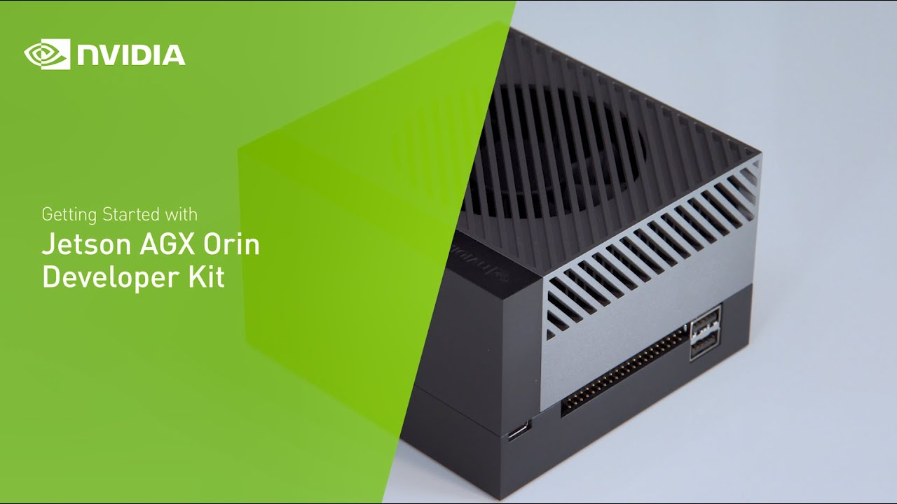
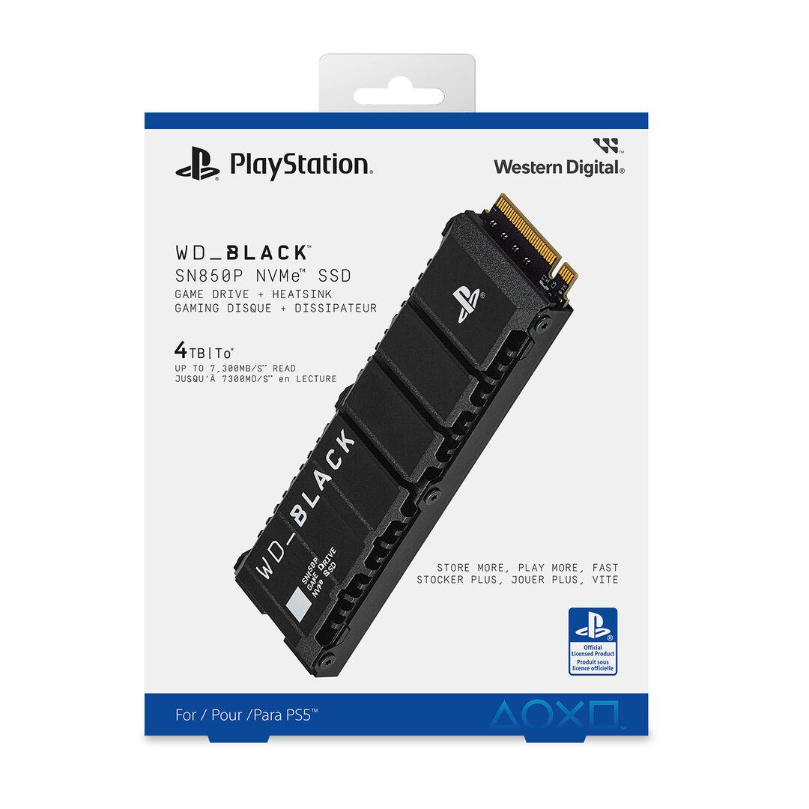

# Diseño de la tarea: INFRA-10 — Investigar requisitos hardware

Este documento describe la tarea **[INFRA-10]** dentro del proyecto **Cl@udiata: Modelos de Lenguaje en la Analítica Deportiva**.  
Incluye la descripción, objetivos, planificación, recursos, análisis, riesgos y resultados esperados para que otros estudiantes puedan reproducir el trabajo en su entorno.

---

## Tabla de contenidos
1. [Descripción y Objetivo](#1-descripción-y-objetivo)
2. [Requisitos / Contexto](#2-requisitos--contexto)
3. [Procedimiento / Comparativa de GPUs](#3-procedimiento--comparativa-de-gpus)
4. [Resultados esperados / Outputs](#4-resultados-esperados--outputs)
5. [Disco NVMe externo y flujo de datos](#5-disco-nvme-externo-y-flujo-de-datos)
6. [Riesgos / Bloqueos](#6-riesgos--bloqueos)
7. [Conclusión](#7-conclusión)
8. [Referencias](#8-referencias)

---

## 1. Descripción y Objetivo

**Descripción:**  
Cómo estudiante, quiero conocer las especificaciones y requerimientos de las diferentes opciones de GPU para seleccionar el hardware adecuado para el TFG. 

**Objetivo:**  
Seleccionar el modelo de GPU que ofrezca un equilibrio óptimo entre capacidad de procesamiento e impacto ambiental asociado al entrenamiento y ejecución de modelos del **agente IA**.

---

## 2. Requisitos / Contexto

El diseño se ha fundamentado en los siguientes requerimientos clave:

- Desarrollo de un **agente IA generativo** capaz de responder preguntas sobre datos de partidos y estadísticas.
- Implementación de un **almacén de datos distribuido** siguiendo la Arquitectura Medallón.
- **Procesamiento de vídeo** para análisis deportivo y generación de clips.
- Capacidad de **inferir y entrenar modelos IA** localmente usando GPU compatible con TensorFlow, PyTorch, CUDA o TensorRT.
- **Eficiencia energética** y bajo consumo para operar en entornos con recursos limitados.
- Escalabilidad para **futuros proyectos** y privacidad de datos.

---

## 3. Procedimiento / Comparativa de GPUs

Existen diversas opciones dentro del mercado. Este análisis se centra en GPUs de **NVIDIA**, por su compatibilidad con TensorFlow, PyTorch, CUDA y TensorRT.

### 3.1 Gama Tesla
- Tarjetas profesionales (T4, A100) diseñadas para centros de investigación y computación en la nube.
- Alto rendimiento pero requieren mucho espacio, buena ventilación y alto coste.
- ❌ No viables para el TFG por limitaciones de recursos.

### 3.2 Gama RTX
- Series RTX 30 y 40, buena relación precio/rendimiento.
- Popularizadas para IA y minería de criptomonedas.
- Requieren hardware adicional (CPU, RAM), buena refrigeración y alto consumo energético.
- ❌ No viables por sostenibilidad y coste.

### 3.3 Familia NVIDIA Jetson
- Solución optimizada para Edge computing, integrando GPU, CPU y memoria en un solo dispositivo.
- Modelos: Jetson Nano, Xavier, Jetson AGX Orin.
- Ventajas: compacta, eficiente energéticamente, potente para inferencia local.
- ✅ Elección ideal para el proyecto por eficiencia y soporte LLM.

---

## 4. Resultados esperados / Outputs

### 4.1 Tabla comparativa de GPUs

| Dispositivo                 | TFLOPs FP16/FP32 | VRAM       | Costo (€) | Consumo (W) | Compatibilidad LLM | Idoneidad entorno local |
|-----------------------------|-----------------|------------|-----------|-------------|------------------|------------------------|
| NVIDIA A100                 | 312 / 19.5      | 40 GB      | 10.000    | 400         | Alta             | Muy alto coste y consumo, mejor en centros de datos |
| NVIDIA RTX 4090             | 330 / 82.6      | 24 GB      | 1.900     | 450         | Alta             | Consumo y espacio alto |
| Jetson AGX Orin Dev Kit     | 275 (INT8)/65   | 32 GB LPDDR5 | 2.000     | 50 (config) | Alta (LLaMA 2)  | Ideal: eficiente e integrado |

### 4.2 NVIDIA Jetson AGX Orin Developer Kit - DAFO

**Fortalezas**
- Alto rendimiento para inferencia de modelos IA.
- Bajo consumo energético y VRAM suficiente (32 GB LPDDR5).
- Compatibilidad con PyTorch, CUDA y TensorRT.
- Escalabilidad y reutilización del hardware.
- Alineación con sostenibilidad y privacidad.

**Oportunidades**
- Integración con futuros proyectos IA.
- Desarrollo de soluciones locales sin dependencia de la nube.
- Posibilidad de entrenar modelos optimizados para inferencia INT8.

**Debilidades**
- Arquitectura aarch64, puede dificultar despliegue de software tradicional.
- Almacenamiento interno limitado, aunque ampliable.
- Dependencia del ecosistema NVIDIA.

**Amenazas**
- Evolución rápida del hardware IA.
- Limitaciones frente a estaciones de trabajo grandes.

---

## 5. Disco NVMe externo

Para garantizar análisis precisos y respuestas contextualizadas del **agente IA**, se ha adquirido un **disco NVMe externo 4 TB con disipador** (**WD Black SN850 NVME SSD for PS5**) por los siguientes motivos:

- Capacidad suficiente para almacenar 3 años de datos históricos.
- Disipador integrado para evitar sobrecalentamiento.
- Compatible con Jetson AGX Orin.

---

## 6. Riesgos / Bloqueos

|ID  |Riesgo |Consecuencia |Prob. |Imp. |Nivel |Plan de mitigación|
|----|-------|------------|------|-----|------|-----------------|
|R2  |Incompatibilidad de frameworks RAG/MCP con Jetson |Limitaciones en funcionalidades |Media |Alta |🔴 Alta |Usar alternativas nativas NVIDIA (Nvidia-Container, PyTorch, CUDA, TensorRT bajo jetson-contains)|
---

## 7. Conclusión

La **NVIDIA Jetson AGX Orin Developer Kit** con disco **WD Black SN850 NVME SSD** es la opción óptima para desplegar el **agente IA** en clubes semiprofesionales de fútbol, garantizando:

- Escalabilidad y rendimiento
- Eficiencia energética
- Soporte para inferencia y entrenamiento local
- Seguridad y privacidad

---

## 8. Referencias

- [Jetson AGX Orin Devkit User Guide](https://developer.nvidia.com/embedded/learn/jetson-agx-orin-devkit-user-guide/developer_kit_layout.html)
- [Jetson AGX Orin Developer Kit Carrier Board Specification](https://developer.nvidia.com/assets/embedded/secure/jetson/agx_orin/jetson_agx_orin_devkit_carrier_board_specification_sp)
- [Especificaciones Técnicas de WD Black SN850 NVME SSD](https://documents.westerndigital.com/content/dam/doc-library/en_us/assets/public/western-digital/product/internal-drives/wd-black-ssd/data-sheet-wd-black-sn850-nvme-ssd-for-ps5.pdf)
- [Deploying LLaMA 2 Models on Edge Devices](https://www.researchgate.net/publication/380155833_An_Empirical_Analysis_and_Resource_Footprint_Study_of_Deploying_Large_Language_Models_on_Edge_Devices)
- [Energy-Efficient AI Inference on Embedded Devices](https://www.researchgate.net/publication/385300510_Power_Consumption_Benchmark_for_Embedded_AI_Inference)
- [Documentación TensorFlow](https://www.tensorflow.org/?hl=es-419)
- [Documentación PyTorch](https://pytorch.org/docs/stable/index.html)
- [Documentación CUDA Toolkit](https://docs.nvidia.com/cuda/)
- [Documentación TensorRT](https://docs.nvidia.com/deeplearning/tensorrt/latest/index.html)
- [European Union AI Act (2023)](https://www.consilium.europa.eu/es/policies/artificial-intelligence/)

