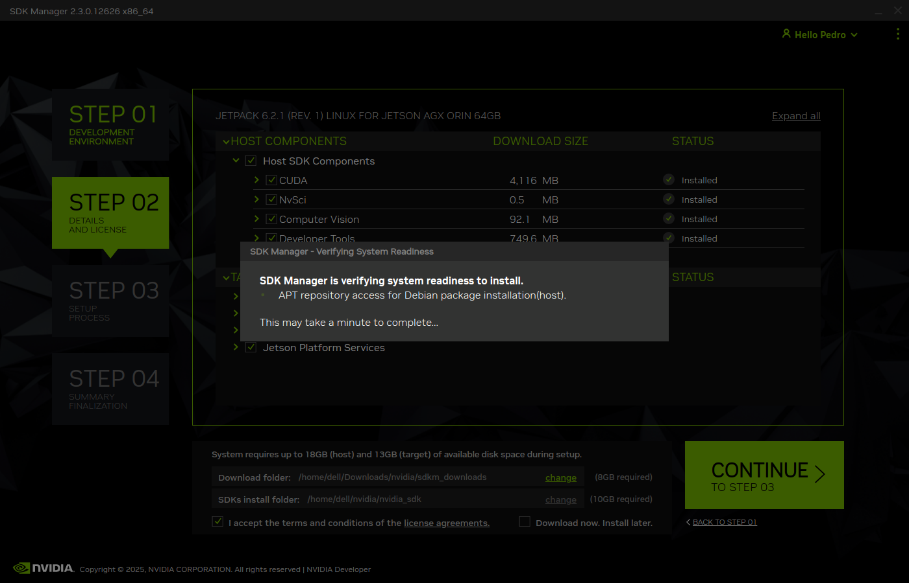
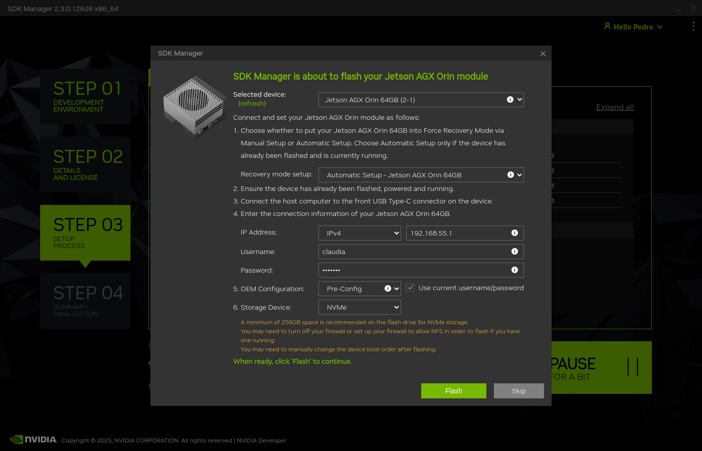
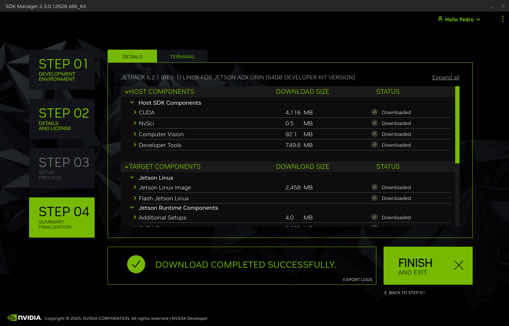

# Configuración del Entorno Jetson AGX Orin

**Proyecto:** Cl@ud-ia-data  
**Épica:** INFRA-20  
**Autor:** Pedro José García  
**Fecha:** Noviembre-Diciembre 2025  
**Hardware:** NVIDIA Jetson AGX Orin 64GB Developer Kit

---

## 1. Resumen Ejecutivo

Este documento detalla la configuración completa del entorno de desarrollo para 
el agente de IA generativa **Cl@ud-ia-data** sobre **NVIDIA Jetson AGX Orin 64GB**.

**Objetivo:** Preparar un entorno local capaz de ejecutar modelos LLM (7B-34B parámetros) con inferencia eficiente, consumo <60W y operación 24/7.

---

## 2. Software Base Instalado

### 2.1 Sistema Operativo y SDK

| Componente | Versión | Comando Verificación |
|------------|---------|----------------------|
| **Ubuntu** | 22.04.5 LTS (aarch64) | `lsb_release -a` |
| **Linux Kernel** | 5.15.148-tegra | `uname -r` |
| **JetPack SDK** | 6.2.1+b38 | `sudo apt-cache show nvidia-jetpack \| grep Version` |
| **CUDA Toolkit** | 12.6.68 | `nvcc --version` |
| **cuDNN** | 9.16.0 | `dpkg -l \| grep cudnn` |
| **TensorRT** | 10.3.0.30 | `dpkg -l \| grep tensorrt` |
| **Docker** | 29.0.1 | `docker --version` |
| **VS Code** | 1.106.0 (arm64) | `code --version` |
| **Conda** | 25.9.1 | `conda --version` |
| **Python** | 3.10.19 | `python --version` |
| **Ollama** | 0.13.3 | `ollama --version` |

**Verificación CUDA:**
```bash
$ nvcc --version
nvcc: NVIDIA (R) Cuda compiler driver
Copyright (c) 2005-2024 NVIDIA Corporation
Built on Wed_Aug_14_10:14:07_PDT_2024
Cuda compilation tools, release 12.6, V12.6.68
Build cuda_12.6.r12.6/compiler.34714021_0
```

---

## 3. Flasheo del Sistema Operativo (JetPack)

### 3.1 Requisitos Previos

**Host Ubuntu necesario:**
- Ubuntu 20.04 o 22.04 LTS (x86_64)
- Conexión a internet estable (descargas ~10GB)
- Cuenta de desarrollador NVIDIA (gratuita): https://developer.nvidia.com
- Cable USB-C de datos (Jetson → PC host)
- Mínimo 40GB espacio libre en disco

**Descarga SDK Manager:** https://developer.nvidia.com/sdk-manager

---

### 3.2 Instalación SDK Manager (en PC host)
```bash
# En tu PC Ubuntu (NO en la Jetson)
sudo apt-get update
sudo apt-get -y install sdkmanager
```

---

### 3.3 Poner Jetson en Modo Recovery

**Pasos físicos:**

1. **Apagar** el dispositivo completamente
2. **Conectar** cable USB-C al puerto "Recovery/Flash" de la Jetson
3. **Conectar** el otro extremo al PC host
4. **Mantener presionado** el botón "Force Recovery"
5. **Mientras mantienes Force Recovery**, presionar botón "Power" durante 2 segundos
6. **Soltar ambos botones**

**Verificar modo recovery (en PC host):**
```bash
lsusb | grep -i nvidia
# Debe aparecer: NVIDIA Corp. APX
```

---

### 3.4 Proceso de Flasheo con SDK Manager

**Ejecutar SDK Manager:**
```bash
sdkmanager
```

**Pasos en la interfaz gráfica:**

| Paso | Acción | Captura |
|------|--------|---------|
| **LOGIN** | Iniciar sesión con cuenta de desarrollador de NVIDIA |   |
| **STEP 1: Hardware** | Seleccionar: **Jetson AGX Orin [64GB developer kit version]** |  |
| **STEP 1: SDK** | Seleccionar: **JetPack 6.2.1 (rev. 1)** <br> Clic en **Continue** |   |
| **STEP 2: Componentes** | Seleccionar **TODOS**: <br> ✅ Jetson OS <br> ✅ CUDA Toolkit <br> ✅ cuDNN <br> ✅ TensorRT <br> ✅ NvSci <br> ✅ Computer Vision <br> ✅ Developer Tools |  |
| **STEP 3: Configuración** | - **IP Address:** Automático <br> - **Usuario:** claudia <br> - **Storage Device:** NVMe <br> Clic en **Flash** |   |
| **STEP 4: Instalación** | Esperar descarga (~10 GB) y flasheo (~20 min) <br> Jetson reiniciará automáticamente <br> Clic en **Finish** cuando termine |  |


**Tiempo total:** ~40-60 minutos (dependiendo de velocidad de internet)

**Resultado esperado:**
- ✅ Jetson bootea Ubuntu 22.04
- ✅ JetPack 6.2.1 instalado
- ✅ CUDA, cuDNN, TensorRT configurados

---

### 3.5 Primera Configuración (en la Jetson)

Tras el primer boot, la Jetson pedirá:

1. **Idioma:** Español / English
2. **Teclado:** Spanish / English (US)
3. **Conectar WiFi** (opcional, recomendado)
4. **Crear usuario:** claudia (ya configurado en SDK Manager)
5. **Zona horaria:** Europe/Madrid

**Verificar instalación:**
```bash
# En la Jetson (SSH o terminal local)
nvidia-smi  # Debe mostrar información de la GPU
nvcc --version  # Debe mostrar CUDA 12.6
```

---

## 4. Configuración Post-Instalación

### 4.1 Setup Inicial (jetson-orin-setup)

**Script utilizado:** https://github.com/jetsonhacks/jetson-orin-setup
```bash
# Ya en la Jetson (SSH o terminal local)
git clone https://github.com/jetsonhacks/jetson-orin-setup.git
cd jetson-orin-setup

# Ejecutar script de configuración
chmod +x setup_jetson.sh
./setup_jetson.sh
```

**Componentes instalados automáticamente:**
- ✅ Chromium Browser (142.0.7444.59 via snap)
- ✅ Python 3 pip (22.0.2+dfsg-1ubuntu0.7)
- ✅ jetson-stats 4.3.2 (herramienta de monitoreo `jtop`)
- ✅ VS Code 1.106.0 (ARM64 nativo)
- ✅ Docker 29.0.1 + containerd 2.1.5
- ✅ Terminal con fuente aumentada (Monospace 16)

---

### 4.2 Instalación CUDA Toolkit 12.6

**Repositorio local:**
```bash
cd /tmp

# Descargar pinning file
wget https://developer.download.nvidia.com/compute/cuda/repos/ubuntu2204/arm64/cuda-ubuntu2204.pin
sudo mv cuda-ubuntu2204.pin /etc/apt/preferences.d/cuda-repository-pin-600

# Descargar repositorio local (2.15 GB)
wget https://developer.download.nvidia.com/compute/cuda/12.6.0/local_installers/cuda-tegra-repo-ubuntu2204-12-6-local_12.6.0-1_arm64.deb

# Instalar repositorio
sudo dpkg -i cuda-tegra-repo-ubuntu2204-12-6-local_12.6.0-1_arm64.deb

# Copiar clave GPG
sudo cp /var/cuda-tegra-repo-ubuntu2204-12-6-local/cuda-tegra-926CAC27-keyring.gpg /usr/share/keyrings/

# Actualizar e instalar
sudo apt-get update
sudo apt-get -y install cuda-toolkit-12-6 cuda-compat-12-6
```

---

### 4.3 Instalación cuDNN 9.16.0
```bash
# Descargar repositorio local
wget https://developer.download.nvidia.com/compute/cudnn/9.16.0/local_installers/cudnn-local-tegra-repo-ubuntu2204-9.16.0_1.0-1_arm64.deb

# Instalar repositorio
sudo dpkg -i cudnn-local-tegra-repo-ubuntu2204-9.16.0_1.0-1_arm64.deb

# Copiar clave GPG
sudo cp /var/cudnn-local-tegra-repo-ubuntu2204-9.16.0/cudnn-*-keyring.gpg /usr/share/keyrings/

# Actualizar e instalar
sudo apt-get update
sudo apt-get -y install cudnn
```

---

### 4.4 Compilación CUDA Samples

**Propósito:** Validar instalación CUDA y medir rendimiento GPU.
```bash
# Clonar repositorio (versión 12.8)
cd /usr/local
sudo git clone --branch v12.8 https://github.com/NVIDIA/cuda-samples.git

# Cambiar permisos
sudo chown -R $USER:$USER cuda-samples

# Compilar utilidades
cd cuda-samples
mkdir build_utils && cd build_utils
cmake ../Samples/1_Utilities -DCMAKE_CUDA_ARCHITECTURES=89
make -j$(nproc)
```

**Nota:** `CMAKE_CUDA_ARCHITECTURES=89` corresponde a la arquitectura Ampere del Jetson Orin (SM 8.9).

---

## 5. Validación del Entorno

### 5.1 deviceQuery

**Ejecutar:**
```bash
/usr/local/cuda-samples/build_utils/deviceQuery/deviceQuery
```

**Salida esperada:**
```
Device 0: "Orin"
  CUDA Driver Version / Runtime Version          12.6 / 12.6
  CUDA Capability Major/Minor version number:    8.7
  Total amount of global memory:                 62841 MBytes (65893269504 bytes)
  (008) Multiprocessors, (128) CUDA Cores/MP:    1024 CUDA Cores
  GPU Max Clock rate:                            1300 MHz (1.30 GHz)
  Memory Clock rate:                             612 Mhz
  Memory Bus Width:                              256-bit
  L2 Cache Size:                                 4194304 bytes

Result = PASS ✅
```

---

### 5.2 bandwidthTest

**Ejecutar:**
```bash
/usr/local/cuda-samples/build_utils/bandwidthTest/bandwidthTest
```

**Resultados:**
```
Host to Device Bandwidth:     15.6 GB/s
Device to Host Bandwidth:     14.8 GB/s
Device to Device Bandwidth:   67.0 GB/s

Result = PASS ✅
```

---

## 6. Instalación del Stack de IA

### 6.1 Ollama (Runtime de LLMs)

**Instalación:**
```bash
curl -fsSL https://ollama.com/install.sh | sh
```

**Verificación:**
```bash
$ ollama --version
ollama version is 0.13.3
```

**Descargar modelos:**
```bash
# Modelo ligero para pruebas
$ ollama pull llama3.2:3b

# Modelo principal (balance calidad/rendimiento)
$ ollama pull qwen2.5:32b

# Modelo máxima calidad (calidad máxima, si hay RAM disponible)
$ ollama pull llama3.3:70b

# Modelo de embeddings para RAG
$ ollama pull mxbai-embed-large
```

**Modelos instalados:**
```bash
$ ollama list
NAME                        ID              SIZE      MODIFIED
qwen2.5:32b                 9f13ba1299af    19 GB     12 days ago
mxbai-embed-large:latest    468836162de7    669 MB    5 weeks ago
llama3.3:70b                a6eb4748fd29    42 GB     5 weeks ago
llama3.2:3b                 a80c4f17acd5    2.0 GB    5 weeks ago
```

**Análisis de modelos:**

| Modelo | Tamaño | RAM Estimada | Consumo GPU | TPS Estimado | Caso de Uso |
|--------|--------|--------------|-------------|--------------|-------------|
| **llama3.2:3b** | 2.0 GB | ~3 GB | ~6W | ~18 t/s | Pruebas rápidas, desarrollo |
| **llama3:8b** | 4.7 GB | ~6 GB | ~8W | ~10-12 t/s | Producción ligera |
| **llama3.3:70b** | 42 GB | ~50 GB | ~15W | ~2-3 t/s | Validación calidad máxima |
| **mxbai-embed-large** | 669 MB | ~1 GB | ~2W | N/A | Generación embeddings (RAG) |

**Ubicación de modelos:**
```bash
$ sudo ls -lh /usr/share/ollama/.ollama/models/blobs/
total 50G
-rw-r--r-- 1 ollama ollama 4.7G  sha256-365c0bd3c000...  # llama3:8b
-rw-r--r-- 1 ollama ollama 42G   sha256-a6eb4748fd29...  # llama3.3:70b
-rw-r--r-- 1 ollama ollama 2.0G  sha256-a80c4f17acd5...  # llama3.2:3b
-rw-r--r-- 1 ollama ollama 669M  sha256-468836162de7...  # mxbai-embed
```

---

### 6.2 Prueba de Inferencia

**Comando:**
```bash
$ ollama run llama3:8b "¿Cuál es la capital de Francia?"
La capital de Francia es París.
```

**Monitoreo con tegrastats:**

| Estado | GR3D_FREQ | RAM | VDD_GPU_SOC | VDD_CPU_CV | VIN_SYS_5V0 | Temp |
|--------|-----------|-----|-------------|------------|-------------|------|
| **Inferencia (8B)** | 99% | 12.5/62.8 GB | ~8.5W | ~2.0W | ~8W | 48°C |
| **Reposo** | 0% | 8.0/62.8 GB | 2.8W | 0.8W | 4.2W | 45°C |

**Conclusiones:**
- ✅ GPU se activa al 99% durante inferencia
- ✅ Consumo pico: ~8W (modelo 8B)
- ✅ Temperatura estable <50°C
- ✅ Memoria disponible: 50GB libres (suficiente para modelos 70B)

---

### 6.3 vLLM (Instalado, evaluación pendiente RAG-10)

**Estado:** Instalado exitosamente pero **evaluación comparativa pospuesta a RAG-10**.

**Configuración PyPI Jetson:**
```bash
pip config set global.index-url https://pypi.jetson-ai-lab.io/jp6/cu126
```

**Instalación:**
```bash
pip install vllm
```

**Paquetes instalados:**
- torch==2.8.0 (226 MB, CUDA 12.6 compatible)
- vllm==0.10.2+cu126 (688 MB)
- transformers==4.57.1
- ray==2.51.1
- cupy-cuda12x==13.6.0 (126 MB)

**Decisión:** Comparativa Ollama vs vLLM se realizará en **RAG-10** con benchmarks completos.

---

### 6.4 Instalación de Miniforge (Conda para ARM64)

**Descargar e instalar:**
```bash
cd /tmp
wget https://github.com/conda-forge/miniforge/releases/latest/download/Miniforge3-Linux-aarch64.sh
bash Miniforge3-Linux-aarch64.sh -b -p $HOME/miniforge3

# Inicializar conda
~/miniforge3/bin/conda init bash
source ~/.bashrc
```

**Verificación:**
```bash
conda --version
# conda 25.9.1
```

### 6.5 Crear Entorno para el Proyecto

**Crear entorno base:**
```bash
conda create -y -n tfg python=3.10
conda activate tfg
```

**Instalar dependencias del proyecto:**
```bash
# Navegar al directorio del proyecto
cd ~/perisperis  # Ajustar según tu estructura

# Actualizar entorno desde environment.yml
conda env update --name tfg --file environment.yml --prune
```

**Contenido mínimo de `environment.yml`:**
```yaml
name: tfg
channels:
  - conda-forge
  - defaults
dependencies:
  - python=3.10
  - pip
  - pip:
    # Core
    - streamlit==1.36.0
    - pandas==2.2.3
    - numpy>=1.24.0
    - matplotlib==3.10.8
    - seaborn==0.13.2
    
    # LLM y RAG
    - ollama==0.6.1
    - langchain==1.1.3
    - langchain-community==0.4.1
    - langchain-ollama==1.0.1
    - chromadb==1.3.7
    - sentence-transformers==5.1.2
    
    # PDF Processing
    - pdfplumber==0.11.8
    - camelot-py==0.11.0
    - pypdf2==3.0.1
    
    # Jupyter
    - jupyterlab==4.5.1
    - ipykernel==6.29.5
    - ipywidgets==8.1.8
```

### 6.6 Registrar Kernel de Jupyter

**Instalar y registrar el kernel:**
```bash
conda activate tfg
python -m ipykernel install --user --name=tfg --display-name="Python (tfg)"
```

**Verificar kernels disponibles:**
```bash
jupyter kernelspec list
```

**Salida esperada:**
```
Available kernels:
  tfg        /home/claudia/.local/share/jupyter/kernels/tfg
  python3    /home/claudia/miniforge3/envs/tfg/share/jupyter/kernels/python3
```

---

## 7. Herramientas Adicionales

### 7.1 Dependencias de Sistema
```bash
sudo apt install -y \
    mesa-utils \
    git \
    python3-pip \
    python3-venv \
    build-essential \
    cmake \
    nano \
    curl \
    wget
```

### 7.2 jetson-stats (Monitoreo)

**Instalación:**
```bash
sudo pip3 install -U jetson-stats
```

**Uso:**
```bash
# Interfaz gráfica de monitoreo
jtop

# Estadísticas en terminal
tegrastats
```

## 8. Configuración de JupyterLab como Servicio

Para el desarrollo experimental, la validación de hipótesis y la ejecución de pruebas reproducibles, se ha utilizado **JupyterLab** como entorno interactivo principal. Este entorno ha permitido ejecutar notebooks asociados a las distintas épicas del proyecto, facilitando la exploración de resultados, la instrumentación de métricas y la trazabilidad entre experimentos y decisiones técnicas adoptadas.

### 8.1 Configurar Contraseña de Acceso

**Establecer contraseña:**
```bash
conda activate tfg
jupyter lab password
# Enter password: [tu-contraseña]
# Verify password: [tu-contraseña]
```

**Ubicación del hash:** `~/.jupyter/jupyter_server_config.json`

### 8.2 Crear Servicio systemd

**Crear archivo de servicio:**
```bash
sudo vi /etc/systemd/system/jupyterlab.service
```

**Contenido del archivo:**
```ini
[Unit]
Description=JupyterLab Server - Entorno TFG
After=network.target
Documentation=https://jupyterlab.readthedocs.io/

[Service]
Type=simple
User=claudia
Group=claudia
WorkingDirectory=/home/claudia/perisperis

# PATH del entorno TFG
Environment="PATH=/home/claudia/miniforge3/envs/tfg/bin:/usr/local/sbin:/usr/local/bin:/usr/sbin:/usr/bin:/sbin:/bin"

# Configuración de ejecución
ExecStart=/home/claudia/miniforge3/envs/tfg/bin/jupyter lab \
    --port=8080 \
    --ip=0.0.0.0 \
    --no-browser \
    --notebook-dir=/home/claudia/perisperis

# Reinicio automático en caso de fallo
Restart=on-failure
RestartSec=10
StartLimitInterval=200
StartLimitBurst=5

# Logs separados
StandardOutput=append:/var/log/jupyterlab-tfg.log
StandardError=append:/var/log/jupyterlab-tfg-error.log

# Seguridad
NoNewPrivileges=true

[Install]
WantedBy=multi-user.target
```

**Notas de configuración:**
- `User` y `Group`: Ajustar al usuario del sistema
- `WorkingDirectory`: Directorio raíz del proyecto
- `--port=8080`: Puerto de acceso (ajustar si hay conflicto)
- `--notebook-dir`: Carpeta inicial de JupyterLab

### 8.3 Habilitar y Arrancar el Servicio

**Crear archivos de log:**
```bash
sudo touch /var/log/jupyterlab-tfg.log /var/log/jupyterlab-tfg-error.log
sudo chown claudia:claudia /var/log/jupyterlab-tfg*.log
```

**Activar servicio:**
```bash
# Recargar configuración de systemd
sudo systemctl daemon-reload

# Habilitar arranque automático
sudo systemctl enable jupyterlab

# Iniciar servicio
sudo systemctl start jupyterlab

# Verificar estado
sudo systemctl status jupyterlab
```

**Salida esperada:**
```
● jupyterlab-tfg.service - JupyterLab Server - Entorno TFG
     Loaded: loaded (/etc/systemd/system/jupyterlab-tfg.service; enabled)
     Active: active (running) since Wed 2026-01-07 18:28:05 CET
```

### 8.4 Comandos de Gestión del Servicio

```bash
# Ver logs en tiempo real
sudo journalctl -u jupyterlab -f

# Ver logs completos
sudo journalctl -u jupyterlab -n 100

# Reiniciar el servicio
sudo systemctl restart jupyterlab

# Detener el servicio
sudo systemctl stop jupyterlab

# Ver estado
sudo systemctl status jupyterlab
```

### 8.5 Acceso a JupyterLab

**Desde la misma máquina:**
```
http://localhost:8080
```

**Desde otra máquina en la red:**
```
http://[IP-DE-LA-JETSON]:8080
```

**Credenciales:** Contraseña configurada con `jupyter lab password`

---

## 9. Arquitectura Final del Stack
```
┌─────────────────────────────────────────────┐
│         APLICACIÓN / INTERFAZ               │
│     (A desarrollar en épicas futuras)       │
└─────────────────────────────────────────────┘
                    ↓
┌─────────────────────────────────────────────┐
│          FRAMEWORK RAG                      │
│        (A seleccionar en RAG-10)            │
└─────────────────────────────────────────────┘
                    ↓
┌──────────────┬──────────────┬──────────────┐
│  LLM RUNTIME │  VECTOR DB   │              │
│   Ollama     │   (RAG-20)   │              │
│   vLLM (?)   │              │              │
└──────────────┴──────────────┴──────────────┘
                    ↓
┌─────────────────────────────────────────────┐
│           ENTORNO PYTHON                    │
│       Conda  + Python  + JupiterLab         │
│  vLLM 0.10.2 (instalado, pendiente prueba)  │
└─────────────────────────────────────────────┘
                    ↓
┌─────────────────────────────────────────────┐
│            JETPACK SDK 6.2.1                │
│   CUDA 12.6 | cuDNN 9.16 | TensorRT 10.3    │
└─────────────────────────────────────────────┘
                    ↓
┌─────────────────────────────────────────────┐
│         JETSON AGX ORIN 64GB                │
│   Ubuntu 22.04.5 ARM64 | Kernel 5.15.148    │
└─────────────────────────────────────────────┘
```

---

## 10. Lecciones Aprendidas

### 10.1 Problemas Encontrados y Soluciones

**1. Flasheo JetPack:**
- ❌ Problema: Jetson no detectada en modo recovery
- ✅ Solución: Usar cable USB-C de **datos** (no solo carga)

**2. PyPI Jetson AI Lab:**
- ❌ Problema: Servidor `pypi.jetson-ai-lab.dev` caído
- ✅ Solución: Usar `pypi.jetson-ai-lab.io`
- Comando: `pip config set global.index-url https://pypi.jetson-ai-lab.io/jp6/cu126`

**3. CUDA Samples Architecture:**
- ❌ Problema: CMake no detecta arquitectura por defecto
- ✅ Solución: Especificar `CMAKE_CUDA_ARCHITECTURES=89`

**4. Selección de Modelo Inicial:**
- ⚠️ Nota: llama3.2:3b es ligero pero limitado para producción
- ✅ Recomendación: llama3:8b como modelo principal (balance óptimo)
- 🔬 Investigación: llama3.3:70b para validar límites y calidad máxima (RAG-10)

### 10.2 Buenas Prácticas

✅ **Repositorios locales NVIDIA** (evita dependencias de internet durante instalación)  
✅ **Validar CUDA con deviceQuery + bandwidthTest** antes de instalar frameworks  
✅ **Monitorear con tegrastats/jtop** durante pruebas de carga  
✅ **Conda environments** para aislar dependencias por proyecto  
✅ **Ollama para prototipado rápido**, vLLM pendiente evaluación para producción  
✅ **Descargar múltiples modelos** para comparativas (3B, 8B, 70B disponibles)

---

## 11. Referencias

**Jetson Setup:**
- jetsonhacks/jetson-orin-setup: https://github.com/jetsonhacks/jetson-orin-setup
- PyPI Jetson: https://pypi.jetson-ai-lab.io/jp6/cu126

**CUDA/cuDNN:**
- CUDA 12.6 Jetson: https://developer.nvidia.com/cuda-12-6-0-download-archive
- cuDNN 9.16.0: https://developer.nvidia.com/cudnn-downloads
- CUDA Samples v12.8: https://github.com/NVIDIA/cuda-samples/tree/v12.8

**Ollama:**
- Guía Jetson AI Lab: https://www.jetson-ai-lab.com/tutorial_ollama.html
- Repositorio oficial: https://github.com/ollama/ollama
- Modelos disponibles: https://ollama.com/library

**vLLM:**
- Documentación oficial: https://docs.vllm.ai

**Documentación NVIDIA:**
- CUDA Installation Guide: https://docs.nvidia.com/cuda/cuda-installation-guide-linux
- CUDA for Tegra: https://docs.nvidia.com/cuda/cuda-for-tegra-appnote
- JetPack SDK: https://developer.nvidia.com/embedded/jetpack